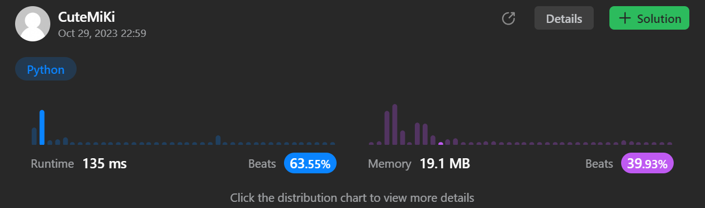

# 705. Design HashSet
### Tag: [Easy](https://github.com/TheOnlyMiki/LeetCode-For-Fun/tree/main#easy-level), [Array](https://github.com/TheOnlyMiki/LeetCode-For-Fun/tree/main#array), [Hash Table](https://github.com/TheOnlyMiki/LeetCode-For-Fun/tree/main#hash-table), [Linked List](https://github.com/TheOnlyMiki/LeetCode-For-Fun/tree/main#linked-list), [Design](https://github.com/TheOnlyMiki/LeetCode-For-Fun/tree/main#design)
---
<div class="px-5 pt-4"><div class="flex"></div><div class="xFUwe" data-track-load="description_content"><p>Design a HashSet without using any built-in hash table libraries.</p>

<p>Implement <code>MyHashSet</code> class:</p>

<ul>
	<li><code>void add(key)</code> Inserts the value <code>key</code> into the HashSet.</li>
	<li><code>bool contains(key)</code> Returns whether the value <code>key</code> exists in the HashSet or not.</li>
	<li><code>void remove(key)</code> Removes the value <code>key</code> in the HashSet. If <code>key</code> does not exist in the HashSet, do nothing.</li>
</ul>

<p>&nbsp;</p>
<p><strong class="example">Example 1:</strong></p>

<pre><strong>Input</strong>
["MyHashSet", "add", "add", "contains", "contains", "add", "contains", "remove", "contains"]
[[], [1], [2], [1], [3], [2], [2], [2], [2]]
<strong>Output</strong>
[null, null, null, true, false, null, true, null, false]

<strong>Explanation</strong>
MyHashSet myHashSet = new MyHashSet();
myHashSet.add(1);      // set = [1]
myHashSet.add(2);      // set = [1, 2]
myHashSet.contains(1); // return True
myHashSet.contains(3); // return False, (not found)
myHashSet.add(2);      // set = [1, 2]
myHashSet.contains(2); // return True
myHashSet.remove(2);   // set = [1]
myHashSet.contains(2); // return False, (already removed)</pre>

<p>&nbsp;</p>
<p><strong>Constraints:</strong></p>

<ul>
	<li><code>0 &lt;= key &lt;= 10<sup>6</sup></code></li>
	<li>At most <code>10<sup>4</sup></code> calls will be made to <code>add</code>, <code>remove</code>, and <code>contains</code>.</li>
</ul>
</div></div>

---


### Solution

```python
class MyHashSet(object):

    def __init__(self):
        self.store = [None] * 1000

    def add(self, key):
        """
        :type key: int
        :rtype: None
        """
        if self.contains(key):
            return

        hashnum1 = key % 1000
        if not self.store[hashnum1]:
            self.store[hashnum1] = [None] * 100

        if not self.store[hashnum1][key % 100]:
            self.store[hashnum1][key % 100] = [key]
        else:
            self.store[hashnum1][key % 100].append(key)

    def remove(self, key):
        """
        :type key: int
        :rtype: None
        """
        if self.contains(key):
            self.store[key % 1000][key % 100].remove(key)

    def contains(self, key):
        """
        :type key: int
        :rtype: bool
        """
        return False if not self.store[key % 1000] else (True if key in self.store[key % 1000][key % 100] else False)


# Your MyHashSet object will be instantiated and called as such:
# obj = MyHashSet()
# obj.add(key)
# obj.remove(key)
# param_3 = obj.contains(key)
```
