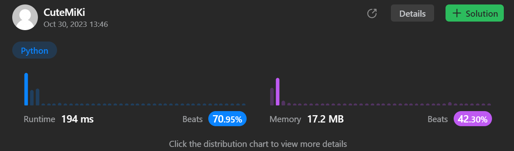

# 706. Design HashMap
### Tag: [Easy](https://github.com/TheOnlyMiki/LeetCode-For-Fun/tree/main#easy-level), [Array](https://github.com/TheOnlyMiki/LeetCode-For-Fun/tree/main#array), [Hash Table](https://github.com/TheOnlyMiki/LeetCode-For-Fun/tree/main#hash-table), [Linked List](https://github.com/TheOnlyMiki/LeetCode-For-Fun/tree/main#linked-list), [Design](https://github.com/TheOnlyMiki/LeetCode-For-Fun/tree/main#design)
---
<div class="px-5 pt-4"><div class="flex"></div><div class="xFUwe" data-track-load="description_content"><p>Design a HashMap without using any built-in hash table libraries.</p>

<p>Implement the <code>MyHashMap</code> class:</p>

<ul>
	<li><code>MyHashMap()</code> initializes the object with an empty map.</li>
	<li><code>void put(int key, int value)</code> inserts a <code>(key, value)</code> pair into the HashMap. If the <code>key</code> already exists in the map, update the corresponding <code>value</code>.</li>
	<li><code>int get(int key)</code> returns the <code>value</code> to which the specified <code>key</code> is mapped, or <code>-1</code> if this map contains no mapping for the <code>key</code>.</li>
	<li><code>void remove(key)</code> removes the <code>key</code> and its corresponding <code>value</code> if the map contains the mapping for the <code>key</code>.</li>
</ul>

<p>&nbsp;</p>
<p><strong class="example">Example 1:</strong></p>

<pre><strong>Input</strong>
["MyHashMap", "put", "put", "get", "get", "put", "get", "remove", "get"]
[[], [1, 1], [2, 2], [1], [3], [2, 1], [2], [2], [2]]
<strong>Output</strong>
[null, null, null, 1, -1, null, 1, null, -1]

<strong>Explanation</strong>
MyHashMap myHashMap = new MyHashMap();
myHashMap.put(1, 1); // The map is now [[1,1]]
myHashMap.put(2, 2); // The map is now [[1,1], [2,2]]
myHashMap.get(1);    // return 1, The map is now [[1,1], [2,2]]
myHashMap.get(3);    // return -1 (i.e., not found), The map is now [[1,1], [2,2]]
myHashMap.put(2, 1); // The map is now [[1,1], [2,1]] (i.e., update the existing value)
myHashMap.get(2);    // return 1, The map is now [[1,1], [2,1]]
myHashMap.remove(2); // remove the mapping for 2, The map is now [[1,1]]
myHashMap.get(2);    // return -1 (i.e., not found), The map is now [[1,1]]
</pre>

<p>&nbsp;</p>
<p><strong>Constraints:</strong></p>

<ul>
	<li><code>0 &lt;= key, value &lt;= 10<sup>6</sup></code></li>
	<li>At most <code>10<sup>4</sup></code> calls will be made to <code>put</code>, <code>get</code>, and <code>remove</code>.</li>
</ul>
</div></div>

---


### Solution

```python
class MyHashMap(object):

    def __init__(self):
        self.storeKeys = [None] * 1000

    def put(self, key, value):
        """
        :type key: int
        :type value: int
        :rtype: None
        """
        hashnum1 = key % 1000
        if not self.storeKeys[hashnum1]:
            self.storeKeys[hashnum1] = [None] * 100

        hashnum2 = key % 100
        if self.storeKeys[hashnum1][hashnum2]:
            if key in self.storeKeys[hashnum1][hashnum2][0]:
                self.storeKeys[hashnum1][hashnum2][1][ self.storeKeys[hashnum1][hashnum2][0].index(key) ] = value
            else:
                self.storeKeys[hashnum1][hashnum2][0].append(key)
                self.storeKeys[hashnum1][hashnum2][1].append(value)
        else:
            self.storeKeys[hashnum1][hashnum2] = [[key], [value]]

    def get(self, key):
        """
        :type key: int
        :rtype: int
        """
        hashnum1 = key % 1000
        if self.storeKeys[hashnum1]:
            hashnum2 = key % 100
            if self.storeKeys[hashnum1][hashnum2]:
                if key in self.storeKeys[hashnum1][hashnum2][0]:
                    return self.storeKeys[hashnum1][hashnum2][1][ self.storeKeys[hashnum1][hashnum2][0].index(key) ]

        return -1

    def remove(self, key):
        """
        :type key: int
        :rtype: None
        """
        hashnum1 = key % 1000
        if self.storeKeys[hashnum1]:
            hashnum2 = key % 100
            if key in self.storeKeys[hashnum1][hashnum2][0]:
                index = self.storeKeys[hashnum1][hashnum2][0].index(key)
                self.storeKeys[hashnum1][hashnum2][0].pop(index)
                self.storeKeys[hashnum1][hashnum2][1].pop(index)


# Your MyHashMap object will be instantiated and called as such:
# obj = MyHashMap()
# obj.put(key,value)
# param_2 = obj.get(key)
# obj.remove(key)
```
