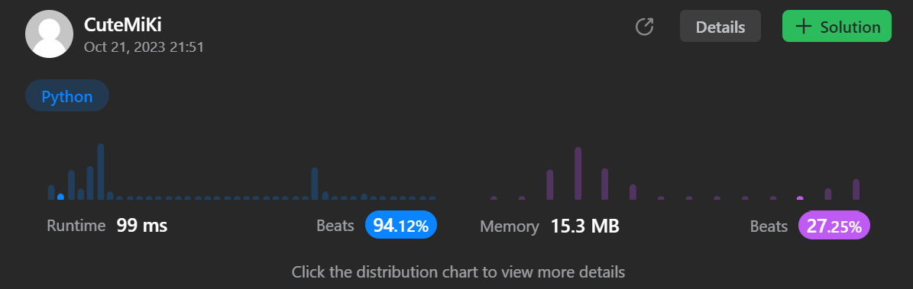

# 707. Design Linked List
### Tag: [Medium](https://github.com/TheOnlyMiki/LeetCode-For-Fun/tree/main#medium-level), [Linked List](https://github.com/TheOnlyMiki/LeetCode-For-Fun/tree/main#linked-list), [Design](https://github.com/TheOnlyMiki/LeetCode-For-Fun/tree/main#design)
---
<div class="px-5 pt-4"><div class="flex"></div><div class="xFUwe" data-track-load="description_content"><p>Design your implementation of the linked list. You can choose to use a singly or doubly linked list.<br>
A node in a singly linked list should have two attributes: <code>val</code> and <code>next</code>. <code>val</code> is the value of the current node, and <code>next</code> is a pointer/reference to the next node.<br>
If you want to use the doubly linked list, you will need one more attribute <code>prev</code> to indicate the previous node in the linked list. Assume all nodes in the linked list are <strong>0-indexed</strong>.</p>

<p>Implement the <code>MyLinkedList</code> class:</p>

<ul>
	<li><code>MyLinkedList()</code> Initializes the <code>MyLinkedList</code> object.</li>
	<li><code>int get(int index)</code> Get the value of the <code>index<sup>th</sup></code> node in the linked list. If the index is invalid, return <code>-1</code>.</li>
	<li><code>void addAtHead(int val)</code> Add a node of value <code>val</code> before the first element of the linked list. After the insertion, the new node will be the first node of the linked list.</li>
	<li><code>void addAtTail(int val)</code> Append a node of value <code>val</code> as the last element of the linked list.</li>
	<li><code>void addAtIndex(int index, int val)</code> Add a node of value <code>val</code> before the <code>index<sup>th</sup></code> node in the linked list. If <code>index</code> equals the length of the linked list, the node will be appended to the end of the linked list. If <code>index</code> is greater than the length, the node <strong>will not be inserted</strong>.</li>
	<li><code>void deleteAtIndex(int index)</code> Delete the <code>index<sup>th</sup></code> node in the linked list, if the index is valid.</li>
</ul>

<p>&nbsp;</p>
<p><strong class="example">Example 1:</strong></p>

<pre><strong>Input</strong>
["MyLinkedList", "addAtHead", "addAtTail", "addAtIndex", "get", "deleteAtIndex", "get"]
[[], [1], [3], [1, 2], [1], [1], [1]]
<strong>Output</strong>
[null, null, null, null, 2, null, 3]

<strong>Explanation</strong>
MyLinkedList myLinkedList = new MyLinkedList();
myLinkedList.addAtHead(1);
myLinkedList.addAtTail(3);
myLinkedList.addAtIndex(1, 2);    // linked list becomes 1-&gt;2-&gt;3
myLinkedList.get(1);              // return 2
myLinkedList.deleteAtIndex(1);    // now the linked list is 1-&gt;3
myLinkedList.get(1);              // return 3
</pre>

<p>&nbsp;</p>
<p><strong>Constraints:</strong></p>

<ul>
	<li><code>0 &lt;= index, val &lt;= 1000</code></li>
	<li>Please do not use the built-in LinkedList library.</li>
	<li>At most <code>2000</code> calls will be made to <code>get</code>, <code>addAtHead</code>, <code>addAtTail</code>, <code>addAtIndex</code> and <code>deleteAtIndex</code>.</li>
</ul>
</div></div>

---


### Solution

```python
# Option 2 - Double Linked List
class Node(object):
    def __init__(self, val=None, next=None, prev=None):
        self.val = val
        self.next = next
        self.prev = prev

class MyLinkedList(object):
    def __init__(self):
        self.index = 0
        self.head = Node()
        self.tail = Node(prev=self.head)
        self.head.next = self.tail

    def get(self, index):
        '''
        :type index: int
        :rtype: int
        '''
        if index >= self.index:
            return -1

        #print("get", index)
        #self.read()

        if index <= self.index // 2:
            current = self.head.next
            while index != 0:
                index, current = index-1, current.next
        else:
            current = self.tail
            while index != self.index:
                index, current = index+1, current.prev

        return current.val

    def addAtHead(self, val):
        '''
        :type val: int
        :rtype: None
        '''
        self.index += 1
        temp = self.head.next
        self.head.next = Node(val, temp, self.head)
        temp.prev = self.head.next

        #print("head")
        #self.read()

    def addAtTail(self, val):
        '''
        :type val: int
        :rtype: None
        '''
        self.index += 1
        temp = self.tail.prev
        self.tail.prev = Node(val, self.tail, temp)
        temp.next = self.tail.prev

        #print("tail")
        #self.read()

    def addAtIndex(self, index, val):
        '''
        :type index: int
        :type val: int
        :rtype: None
        '''
        if index > self.index:
            return

        #print("add", index, self.index)
        #self.read()

        if index <= self.index // 2:
            current = self.head
            while index != 0:
                index, current = index-1, current.next

            temp = Node(val, current.next, current)
            current.next.prev, current.next = temp, temp
        else:
            current = self.tail
            while index != self.index:
                index, current = index+1, current.prev

            temp = Node(val, current, current.prev)
            current.prev.next, current.prev = temp, temp

        self.index += 1

        #print("after add")
        #self.read()

    def deleteAtIndex(self, index):
        '''
        :type index: int
        :rtype: None
        '''
        if index >= self.index:
            return

        #print("delete", index, self.index)
        #self.read()

        if index <= self.index // 2:
            current = self.head
            while index != 0:
                index, current = index-1, current.next

            current.next.next.prev, current.next = current, current.next.next
        else:
            current = self.tail.prev
            while index != self.index:
                index, current = index+1, current.prev

            current.next.next.prev, current.next = current, current.next.next

        self.index -= 1
        
        #print("after delete")
        #self.read()

    """def read(self):
        current = self.head.next
        output = []
        while current:
            output.append(current.val)
            current = current.next

        print(output)"""


# Option 1 - Single Linked List
"""
class Node(object):
    def __init__(self, val=None, next=None):
        self.val = val
        self.next = next

class MyLinkedList(object):
    def __init__(self):
        self.index = 0
        self.head = Node()

    def get(self, index):
        '''
        :type index: int
        :rtype: int
        '''
        if index >= self.index:
            return -1
        
        current = self.head.next
        while index != 0:
            index, current = index-1, current.next

        return current.val

    def addAtHead(self, val):
        '''
        :type val: int
        :rtype: None
        '''
        self.index += 1
        self.head.next = Node(val, self.head.next)

    def addAtTail(self, val):
        '''
        :type val: int
        :rtype: None
        '''
        self.index += 1
        current = self.head
        while current.next:
            current = current.next

        current.next = Node(val)

    def addAtIndex(self, index, val):
        '''
        :type index: int
        :type val: int
        :rtype: None
        '''
        if index > self.index:
            return

        self.index += 1
        current = self.head
        while index != 0:
            index, current = index-1, current.next

        current.next = Node(val, current.next)

    def deleteAtIndex(self, index):
        '''
        :type index: int
        :rtype: None
        '''
        if index >= self.index:
            return

        self.index -= 1
        current = self.head
        while index != 0:
            index, current = index-1, current.next

        current.next = current.next.next
        """


# Your MyLinkedList object will be instantiated and called as such:
# obj = MyLinkedList()
# param_1 = obj.get(index)
# obj.addAtHead(val)
# obj.addAtTail(val)
# obj.addAtIndex(index,val)
# obj.deleteAtIndex(index)
```
