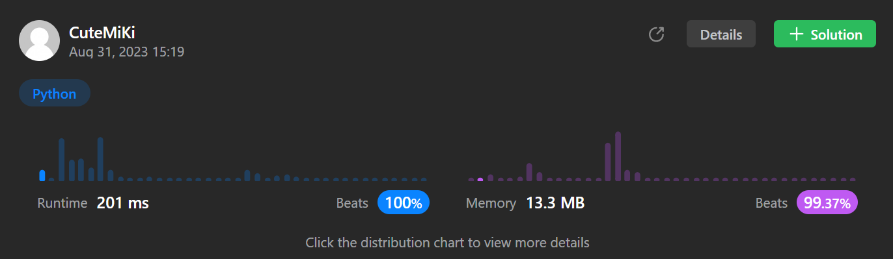

# 712. Minimum ASCII Delete Sum for Two Strings
### Tag: [Medium](https://github.com/TheOnlyMiki/LeetCode-For-Fun/tree/main#medium-level), [String](https://github.com/TheOnlyMiki/LeetCode-For-Fun/tree/main#string), [Dynamic Programming](https://github.com/TheOnlyMiki/LeetCode-For-Fun/tree/main#dynamic-programming)
---
<div class="px-5 pt-4"><div class="flex"></div><div class="xFUwe" data-track-load="description_content"><p>Given two strings <code>s1</code> and&nbsp;<code>s2</code>, return <em>the lowest <strong>ASCII</strong> sum of deleted characters to make two strings equal</em>.</p>

<p>&nbsp;</p>
<p><strong class="example">Example 1:</strong></p>

<pre><strong>Input:</strong> s1 = "sea", s2 = "eat"
<strong>Output:</strong> 231
<strong>Explanation:</strong> Deleting "s" from "sea" adds the ASCII value of "s" (115) to the sum.
Deleting "t" from "eat" adds 116 to the sum.
At the end, both strings are equal, and 115 + 116 = 231 is the minimum sum possible to achieve this.
</pre>

<p><strong class="example">Example 2:</strong></p>

<pre><strong>Input:</strong> s1 = "delete", s2 = "leet"
<strong>Output:</strong> 403
<strong>Explanation:</strong> Deleting "dee" from "delete" to turn the string into "let",
adds 100[d] + 101[e] + 101[e] to the sum.
Deleting "e" from "leet" adds 101[e] to the sum.
At the end, both strings are equal to "let", and the answer is 100+101+101+101 = 403.
If instead we turned both strings into "lee" or "eet", we would get answers of 433 or 417, which are higher.
</pre>

<p>&nbsp;</p>
<p><strong>Constraints:</strong></p>

<ul>
	<li><code>1 &lt;= s1.length, s2.length &lt;= 1000</code></li>
	<li><code>s1</code> and <code>s2</code> consist of lowercase English letters.</li>
</ul>
</div></div>

---


### Solution

```python
class Solution(object):
    def minimumDeleteSum(self, s1, s2):
        """
        :type s1: str
        :type s2: str
        :rtype: int
        """
        len1, len2 = len(s1), len(s2)+1
        cols = range(len2-1)
        record1 = [0] * len2
        record2 = c = None

        for i in range(len1):
            record2 = [0] * len2
            c = s1[i]
            for j in cols:
                record2[j] = record1[j-1] + ord(c) if c == s2[j] else max(record2[j-1], record1[j])

            record1 = record2

        return sum(ord(c) for c in s1+s2) - record2[len2-2]*2
```
