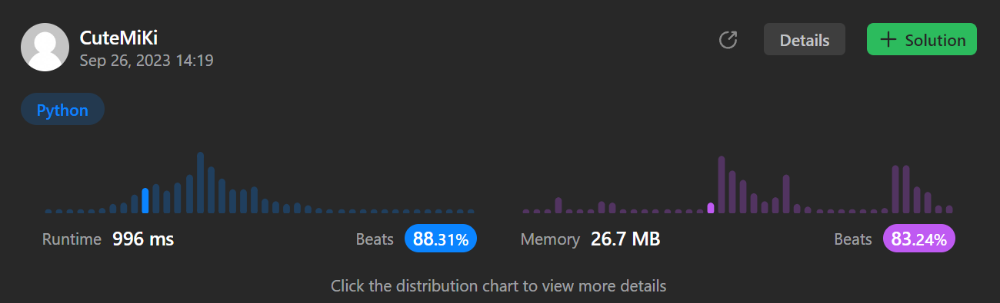

# 739. Daily Temperatures
### Tag: [Medium](https://github.com/TheOnlyMiki/LeetCode-For-Fun/tree/main#medium-level), [Array](https://github.com/TheOnlyMiki/LeetCode-For-Fun/tree/main#array), [Stack](https://github.com/TheOnlyMiki/LeetCode-For-Fun/tree/main#stack)
---
<div class="px-5 pt-4"><div class="flex"></div><div class="xFUwe" data-track-load="description_content"><p>Given an array of integers <code>temperatures</code> represents the daily temperatures, return <em>an array</em> <code>answer</code> <em>such that</em> <code>answer[i]</code> <em>is the number of days you have to wait after the</em> <code>i<sup>th</sup></code> <em>day to get a warmer temperature</em>. If there is no future day for which this is possible, keep <code>answer[i] == 0</code> instead.</p>

<p>&nbsp;</p>
<p><strong class="example">Example 1:</strong></p>
<pre><strong>Input:</strong> temperatures = [73,74,75,71,69,72,76,73]
<strong>Output:</strong> [1,1,4,2,1,1,0,0]
</pre><p><strong class="example">Example 2:</strong></p>
<pre><strong>Input:</strong> temperatures = [30,40,50,60]
<strong>Output:</strong> [1,1,1,0]
</pre><p><strong class="example">Example 3:</strong></p>
<pre><strong>Input:</strong> temperatures = [30,60,90]
<strong>Output:</strong> [1,1,0]
</pre>
<p>&nbsp;</p>
<p><strong>Constraints:</strong></p>

<ul>
	<li><code>1 &lt;=&nbsp;temperatures.length &lt;= 10<sup>5</sup></code></li>
	<li><code>30 &lt;=&nbsp;temperatures[i] &lt;= 100</code></li>
</ul>
</div></div>

---


### Solution

```python
class Solution(object):
    def dailyTemperatures(self, temperatures):
        """
        :type temperatures: List[int]
        :rtype: List[int]
        """
        output = [0] * len(temperatures)
        stack = []
        for i, t in enumerate(temperatures):
            while stack and t > stack[-1][0]:
                temp = stack.pop()
                output[temp[1]] = i - temp[1]

            stack.append((t, i))

        return output
```
