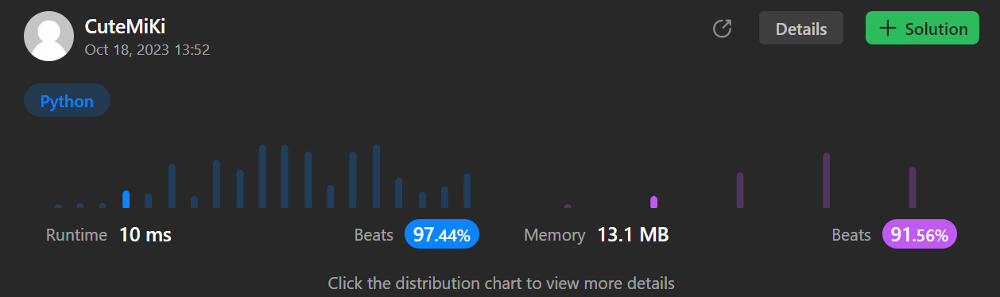

# 747. Largest Number At Least Twice of Others
### Tag: [Easy](https://github.com/TheOnlyMiki/LeetCode-For-Fun/tree/main#easy-level), [Array](https://github.com/TheOnlyMiki/LeetCode-For-Fun/tree/main#array), [Sorting](https://github.com/TheOnlyMiki/LeetCode-For-Fun/tree/main#sorting)
---
<div class="px-5 pt-4"><div class="flex"></div><div class="xFUwe" data-track-load="description_content"><p>You are given an integer array <code>nums</code> where the largest integer is <strong>unique</strong>.</p>

<p>Determine whether the largest element in the array is <strong>at least twice</strong> as much as every other number in the array. If it is, return <em>the <strong>index</strong> of the largest element, or return </em><code>-1</code><em> otherwise</em>.</p>

<p>&nbsp;</p>
<p><strong class="example">Example 1:</strong></p>

<pre><strong>Input:</strong> nums = [3,6,1,0]
<strong>Output:</strong> 1
<strong>Explanation:</strong> 6 is the largest integer.
For every other number in the array x, 6 is at least twice as big as x.
The index of value 6 is 1, so we return 1.
</pre>

<p><strong class="example">Example 2:</strong></p>

<pre><strong>Input:</strong> nums = [1,2,3,4]
<strong>Output:</strong> -1
<strong>Explanation:</strong> 4 is less than twice the value of 3, so we return -1.
</pre>

<p>&nbsp;</p>
<p><strong>Constraints:</strong></p>

<ul>
	<li><code>2 &lt;= nums.length &lt;= 50</code></li>
	<li><code>0 &lt;= nums[i] &lt;= 100</code></li>
	<li>The largest element in <code>nums</code> is unique.</li>
</ul>
</div></div>

---


### Solution

```python
class Solution(object):
    def dominantIndex(self, nums):
        """
        :type nums: List[int]
        :rtype: int
        """
        index, max_1, max_2 = -1, -1, -1
        for i, num in enumerate(nums):
            if num > max_1:
                index, max_1, max_2 = i, num, max_1
            elif num > max_2:
                max_2 = num

        return -1 if max_1 < max_2 * 2 else index
```
