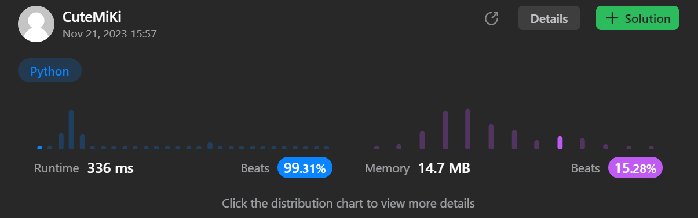

# 752. Open the Lock
### Tag: [Medium](https://github.com/TheOnlyMiki/LeetCode-For-Fun/tree/main#medium-level), [Array](https://github.com/TheOnlyMiki/LeetCode-For-Fun/tree/main#array), [Hash Table](https://github.com/TheOnlyMiki/LeetCode-For-Fun/tree/main#hash-table), [String](https://github.com/TheOnlyMiki/LeetCode-For-Fun/tree/main#string), [Breadth-First Search](https://github.com/TheOnlyMiki/LeetCode-For-Fun/tree/main#breadth-first-search)
---
<div class="px-5 pt-4"><div class="flex"></div><div class="xFUwe" data-track-load="description_content"><p>You have a lock in front of you with 4 circular wheels. Each wheel has 10 slots: <code>'0', '1', '2', '3', '4', '5', '6', '7', '8', '9'</code>. The wheels can rotate freely and wrap around: for example we can turn <code>'9'</code> to be <code>'0'</code>, or <code>'0'</code> to be <code>'9'</code>. Each move consists of turning one wheel one slot.</p>

<p>The lock initially starts at <code>'0000'</code>, a string representing the state of the 4 wheels.</p>

<p>You are given a list of <code>deadends</code> dead ends, meaning if the lock displays any of these codes, the wheels of the lock will stop turning and you will be unable to open it.</p>

<p>Given a <code>target</code> representing the value of the wheels that will unlock the lock, return the minimum total number of turns required to open the lock, or -1 if it is impossible.</p>

<p>&nbsp;</p>
<p><strong class="example">Example 1:</strong></p>

<pre><strong>Input:</strong> deadends = ["0201","0101","0102","1212","2002"], target = "0202"
<strong>Output:</strong> 6
<strong>Explanation:</strong> 
A sequence of valid moves would be "0000" -&gt; "1000" -&gt; "1100" -&gt; "1200" -&gt; "1201" -&gt; "1202" -&gt; "0202".
Note that a sequence like "0000" -&gt; "0001" -&gt; "0002" -&gt; "0102" -&gt; "0202" would be invalid,
because the wheels of the lock become stuck after the display becomes the dead end "0102".
</pre>

<p><strong class="example">Example 2:</strong></p>

<pre><strong>Input:</strong> deadends = ["8888"], target = "0009"
<strong>Output:</strong> 1
<strong>Explanation:</strong> We can turn the last wheel in reverse to move from "0000" -&gt; "0009".
</pre>

<p><strong class="example">Example 3:</strong></p>

<pre><strong>Input:</strong> deadends = ["8887","8889","8878","8898","8788","8988","7888","9888"], target = "8888"
<strong>Output:</strong> -1
<strong>Explanation:</strong> We cannot reach the target without getting stuck.
</pre>

<p>&nbsp;</p>
<p><strong>Constraints:</strong></p>

<ul>
	<li><code>1 &lt;= deadends.length &lt;= 500</code></li>
	<li><code>deadends[i].length == 4</code></li>
	<li><code>target.length == 4</code></li>
	<li>target <strong>will not be</strong> in the list <code>deadends</code>.</li>
	<li><code>target</code> and <code>deadends[i]</code> consist of digits only.</li>
</ul>
</div></div>

---


### Solution

```python
class Solution(object):
    def openLock(self, deadends, target):
        """
        :type deadends: List[str]
        :type target: str
        :rtype: int
        """
        next_states = {
            '0':['1','9'],
            '1':['2','0'],
            '2':['3','1'],
            '3':['4','2'],
            '4':['5','3'],
            '5':['6','4'],
            '6':['7','5'],
            '7':['8','6'],
            '8':['9','7'],
            '9':['0','8'],
        }
        deadends = set(deadends)
        wheels = range(4)

        record = deque()
        record.append(("0000", 0))
        visit = set()

        while record:
            while record and (record[0][0] in visit or record[0][0] in deadends):
                record.popleft()

            if record:
                state, step = record.popleft()

                if state == target:
                    return step

                visit.add(state)
                
                for i in wheels:
                    next_state = state[:i] + next_states[state[i]][0] + state[i+1:]
                    if next_state not in visit and next_state not in deadends:
                        record.append((next_state, step+1))
                    next_state = state[:i] + next_states[state[i]][1] + state[i+1:]
                    if next_state not in visit and next_state not in deadends:
                        record.append((next_state, step+1))

                    #record += [(state[:i] + next_states[state[i]][0] + state[i+1:], step+1), (state[:i] + next_states[state[i]][1] + state[i+1:], step+1)] 

        return -1
```
