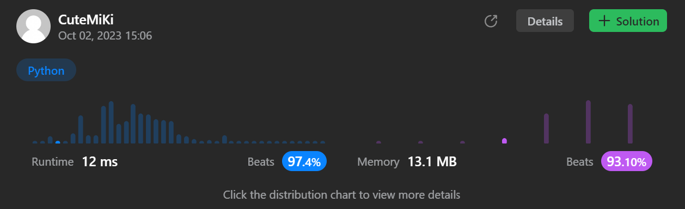

# 763. Partition Labels
### Tag: [Medium](https://github.com/TheOnlyMiki/LeetCode-For-Fun/tree/main#medium-level), [Hash Table](https://github.com/TheOnlyMiki/LeetCode-For-Fun/tree/main#hash-table), [Two Pointers](https://github.com/TheOnlyMiki/LeetCode-For-Fun/tree/main#two-pointers), [String](https://github.com/TheOnlyMiki/LeetCode-For-Fun/tree/main#string), [Greedy](https://github.com/TheOnlyMiki/LeetCode-For-Fun/tree/main#greedy)
---
<div class="px-5 pt-4"><div class="flex"></div><div class="xFUwe" data-track-load="description_content"><p>You are given a string <code>s</code>. We want to partition the string into as many parts as possible so that each letter appears in at most one part.</p>

<p>Note that the partition is done so that after concatenating all the parts in order, the resultant string should be <code>s</code>.</p>

<p>Return <em>a list of integers representing the size of these parts</em>.</p>

<p>&nbsp;</p>
<p><strong class="example">Example 1:</strong></p>

<pre><strong>Input:</strong> s = "ababcbacadefegdehijhklij"
<strong>Output:</strong> [9,7,8]
<strong>Explanation:</strong>
The partition is "ababcbaca", "defegde", "hijhklij".
This is a partition so that each letter appears in at most one part.
A partition like "ababcbacadefegde", "hijhklij" is incorrect, because it splits s into less parts.
</pre>

<p><strong class="example">Example 2:</strong></p>

<pre><strong>Input:</strong> s = "eccbbbbdec"
<strong>Output:</strong> [10]
</pre>

<p>&nbsp;</p>
<p><strong>Constraints:</strong></p>

<ul>
	<li><code>1 &lt;= s.length &lt;= 500</code></li>
	<li><code>s</code> consists of lowercase English letters.</li>
</ul>
</div></div>

---


### Solution

```python
class Solution(object):
    def partitionLabels(self, s):
        """
        :type s: str
        :rtype: List[int]
        """
        count = {}
        for c in s:
            if c in count:
                count[c] += 1
            else:
                count[c] = 1

        i = 0
        visit = set()
        output = []
        for c in s:
            visit.add(c)
            count[c] -= 1
            i += 1

            if count[c] == 0:
                visit.remove(c)
            if len(visit) == 0:
                output.append(i)
                i = 0

        return output
```
