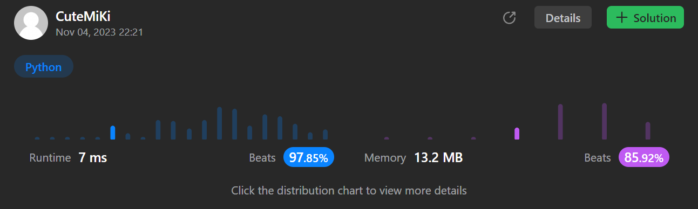

# 771. Jewels and Stones
### Tag: [Easy](https://github.com/TheOnlyMiki/LeetCode-For-Fun/tree/main#easy-level), [Hash Table](https://github.com/TheOnlyMiki/LeetCode-For-Fun/tree/main#hash-table), [String](https://github.com/TheOnlyMiki/LeetCode-For-Fun/tree/main#string)
---
<div class="px-5 pt-4"><div class="flex"></div><div class="xFUwe" data-track-load="description_content"><p>You're given strings <code>jewels</code> representing the types of stones that are jewels, and <code>stones</code> representing the stones you have. Each character in <code>stones</code> is a type of stone you have. You want to know how many of the stones you have are also jewels.</p>

<p>Letters are case sensitive, so <code>"a"</code> is considered a different type of stone from <code>"A"</code>.</p>

<p>&nbsp;</p>
<p><strong class="example">Example 1:</strong></p>
<pre><strong>Input:</strong> jewels = "aA", stones = "aAAbbbb"
<strong>Output:</strong> 3
</pre><p><strong class="example">Example 2:</strong></p>
<pre><strong>Input:</strong> jewels = "z", stones = "ZZ"
<strong>Output:</strong> 0
</pre>
<p>&nbsp;</p>
<p><strong>Constraints:</strong></p>

<ul>
	<li><code>1 &lt;=&nbsp;jewels.length, stones.length &lt;= 50</code></li>
	<li><code>jewels</code> and <code>stones</code> consist of only English letters.</li>
	<li>All the characters of&nbsp;<code>jewels</code> are <strong>unique</strong>.</li>
</ul>
</div></div>

---


### Solution

```python
class Solution(object):
    def numJewelsInStones(self, jewels, stones):
        """
        :type jewels: str
        :type stones: str
        :rtype: int
        """
        count = 0
        for stone in stones:
            if stone in jewels:
                count += 1
                
        return count
```
