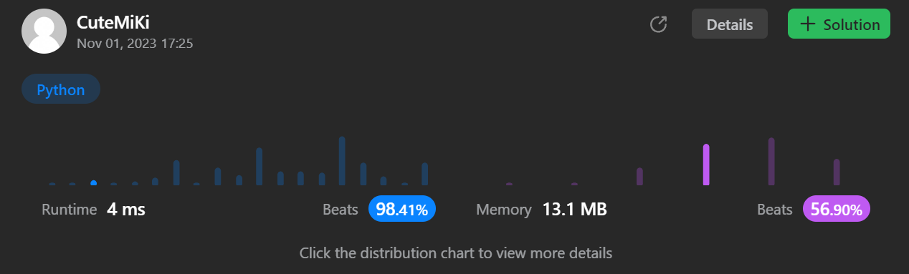

# 779. K-th Symbol in Grammar
### Tag: [Medium](https://github.com/TheOnlyMiki/LeetCode-For-Fun/tree/main#medium-level), [Math](https://github.com/TheOnlyMiki/LeetCode-For-Fun/tree/main#math), [Bit Manipulation](https://github.com/TheOnlyMiki/LeetCode-For-Fun/tree/main#bit-manipulation)
---
<div class="px-5 pt-4"><div class="flex"></div><div class="xFUwe" data-track-load="description_content"><p>We build a table of <code>n</code> rows (<strong>1-indexed</strong>). We start by writing <code>0</code> in the <code>1<sup>st</sup></code> row. Now in every subsequent row, we look at the previous row and replace each occurrence of <code>0</code> with <code>01</code>, and each occurrence of <code>1</code> with <code>10</code>.</p>

<ul>
	<li>For example, for <code>n = 3</code>, the <code>1<sup>st</sup></code> row is <code>0</code>, the <code>2<sup>nd</sup></code> row is <code>01</code>, and the <code>3<sup>rd</sup></code> row is <code>0110</code>.</li>
</ul>

<p>Given two integer <code>n</code> and <code>k</code>, return the <code>k<sup>th</sup></code> (<strong>1-indexed</strong>) symbol in the <code>n<sup>th</sup></code> row of a table of <code>n</code> rows.</p>

<p>&nbsp;</p>
<p><strong class="example">Example 1:</strong></p>

<pre><strong>Input:</strong> n = 1, k = 1
<strong>Output:</strong> 0
<strong>Explanation:</strong> row 1: <u>0</u>
</pre>

<p><strong class="example">Example 2:</strong></p>

<pre><strong>Input:</strong> n = 2, k = 1
<strong>Output:</strong> 0
<strong>Explanation:</strong> 
row 1: 0
row 2: <u>0</u>1
</pre>

<p><strong class="example">Example 3:</strong></p>

<pre><strong>Input:</strong> n = 2, k = 2
<strong>Output:</strong> 1
<strong>Explanation:</strong> 
row 1: 0
row 2: 0<u>1</u>
</pre>

<p>&nbsp;</p>
<p><strong>Constraints:</strong></p>

<ul>
	<li><code>1 &lt;= n &lt;= 30</code></li>
	<li><code>1 &lt;= k &lt;= 2<sup>n - 1</sup></code></li>
</ul>
</div></div>

---


### Solution

```python
class Solution(object):
    def kthGrammar(self, n, k):
        """
        :type n: int
        :type k: int
        :rtype: int
        """
        # Option 2
        def getOutput(n, k):
            if n == 1:
                return 0
            if k & 1 == 0:
                return 1 if getOutput(n-1, k>>1) == 0 else 0
            else:
                return 0 if getOutput(n-1, (k+1)>>1) == 0 else 1

        return getOutput(n, k)

        # Option 1 - BF method, cannot pass
        """
        length = 2
        current = "0110"
        while len(current) < k:
            cut, length = length, len(current)
            current += current[cut:] + current[:cut]
        
        return int(current[k-1])
        """
```
