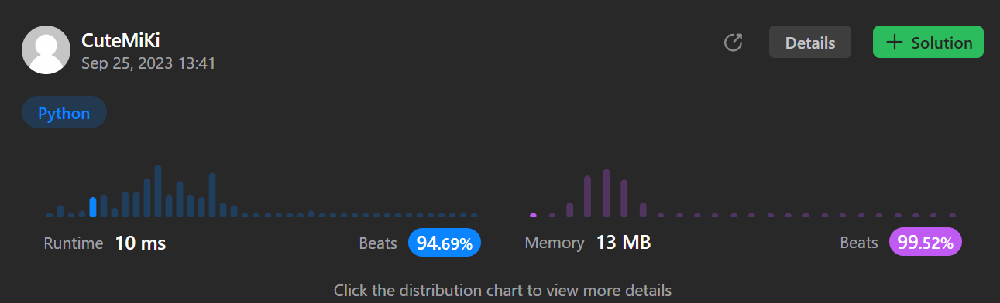

# 790. Domino and Tromino Tiling
### Tag: [Medium](https://github.com/TheOnlyMiki/LeetCode-For-Fun/tree/main#medium-level), [Dynamic Programming](https://github.com/TheOnlyMiki/LeetCode-For-Fun/tree/main#dynamic-programming)
---
<div class="px-5 pt-4"><div class="flex"></div><div class="xFUwe" data-track-load="description_content"><p>You have two types of tiles: a <code>2 x 1</code> domino shape and a tromino shape. You may rotate these shapes.</p>

<p>Given an integer n, return <em>the number of ways to tile an</em> <code>2 x n</code> <em>board</em>. Since the answer may be very large, return it <strong>modulo</strong> <code>10<sup>9</sup> + 7</code>.</p>

<p>In a tiling, every square must be covered by a tile. Two tilings are different if and only if there are two 4-directionally adjacent cells on the board such that exactly one of the tilings has both squares occupied by a tile.</p>

<p>&nbsp;</p>
<p><strong class="example">Example 1:</strong></p>

<pre><strong>Input:</strong> n = 3
<strong>Output:</strong> 5
<strong>Explanation:</strong> The five different ways are show above.
</pre>

<p><strong class="example">Example 2:</strong></p>

<pre><strong>Input:</strong> n = 1
<strong>Output:</strong> 1
</pre>

<p>&nbsp;</p>
<p><strong>Constraints:</strong></p>

<ul>
	<li><code>1 &lt;= n &lt;= 1000</code></li>
</ul>
</div></div>

---


### Solution

```python
class Solution(object):
    def numTilings(self, n):
        """
        :type n: int
        :rtype: int
        """
        mod = 1e9+7
        previou = [1, 2, 5]
        if n < 4:
            return previou[n-1]

        for _ in range(n-3):
            previou[:] = previou[1], previou[2], (previou[2] * 2 + previou[0]) % mod

        return int(previou[2])
```
