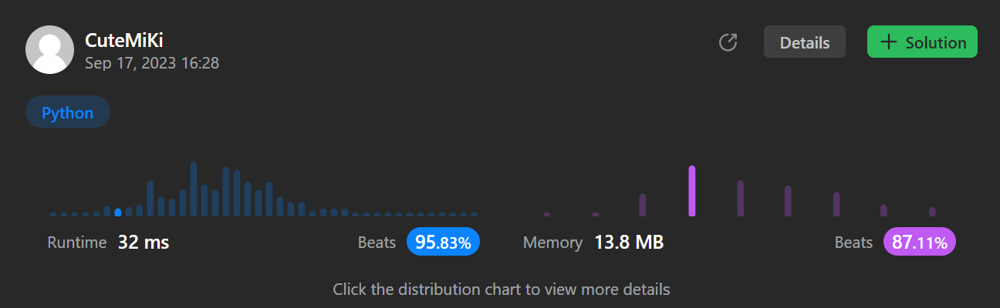

# 841. Keys and Rooms
### Tag: [Medium](https://github.com/TheOnlyMiki/LeetCode-For-Fun/tree/main#medium-level), [Depth-First Search](https://github.com/TheOnlyMiki/LeetCode-For-Fun/tree/main#depth-first-search), [Breadth-First Search](https://github.com/TheOnlyMiki/LeetCode-For-Fun/tree/main#breadth-first-search), [Graph](https://github.com/TheOnlyMiki/LeetCode-For-Fun/tree/main#graph)
---
<div class="px-5 pt-4"><div class="flex"></div><div class="xFUwe" data-track-load="description_content"><p>There are <code>n</code> rooms labeled from <code>0</code> to <code>n - 1</code>&nbsp;and all the rooms are locked except for room <code>0</code>. Your goal is to visit all the rooms. However, you cannot enter a locked room without having its key.</p>

<p>When you visit a room, you may find a set of <strong>distinct keys</strong> in it. Each key has a number on it, denoting which room it unlocks, and you can take all of them with you to unlock the other rooms.</p>

<p>Given an array <code>rooms</code> where <code>rooms[i]</code> is the set of keys that you can obtain if you visited room <code>i</code>, return <code>true</code> <em>if you can visit <strong>all</strong> the rooms, or</em> <code>false</code> <em>otherwise</em>.</p>

<p>&nbsp;</p>
<p><strong class="example">Example 1:</strong></p>

<pre><strong>Input:</strong> rooms = [[1],[2],[3],[]]
<strong>Output:</strong> true
<strong>Explanation:</strong> 
We visit room 0 and pick up key 1.
We then visit room 1 and pick up key 2.
We then visit room 2 and pick up key 3.
We then visit room 3.
Since we were able to visit every room, we return true.
</pre>

<p><strong class="example">Example 2:</strong></p>

<pre><strong>Input:</strong> rooms = [[1,3],[3,0,1],[2],[0]]
<strong>Output:</strong> false
<strong>Explanation:</strong> We can not enter room number 2 since the only key that unlocks it is in that room.
</pre>

<p>&nbsp;</p>
<p><strong>Constraints:</strong></p>

<ul>
	<li><code>n == rooms.length</code></li>
	<li><code>2 &lt;= n &lt;= 1000</code></li>
	<li><code>0 &lt;= rooms[i].length &lt;= 1000</code></li>
	<li><code>1 &lt;= sum(rooms[i].length) &lt;= 3000</code></li>
	<li><code>0 &lt;= rooms[i][j] &lt; n</code></li>
	<li>All the values of <code>rooms[i]</code> are <strong>unique</strong>.</li>
</ul>
</div></div>

---


### Solution

```python
class Solution(object):
    def canVisitAllRooms(self, rooms):
        """
        :type rooms: List[List[int]]
        :rtype: bool
        """
        n = len(rooms)
        record = set(rooms[0])
        keys = {i for i in range(1,n)} - record

        while record:
            temp = set()
            for room in record:
                temp |= set(rooms[room]) & keys
            keys -= temp
            record = temp

        return len(keys) == 0
```
