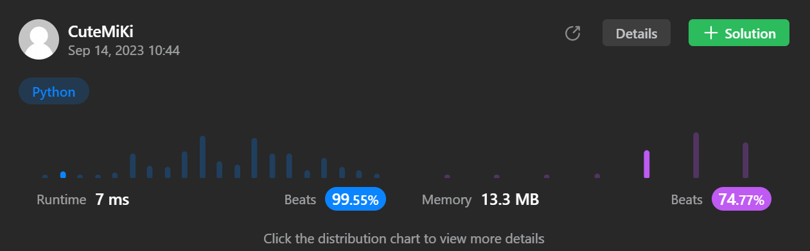

# 872. Leaf-Similar Trees
### Tag: [Easy](https://github.com/TheOnlyMiki/LeetCode-For-Fun/tree/main#easy-level), [Depth-First Search](https://github.com/TheOnlyMiki/LeetCode-For-Fun/tree/main#depth-first-search), [Binary Tree](https://github.com/TheOnlyMiki/LeetCode-For-Fun/tree/main#binary-tree)
---
<div class="px-5 pt-4"><div class="flex"></div><div class="xFUwe" data-track-load="description_content"><p>Consider all the leaves of a binary tree, from&nbsp;left to right order, the values of those&nbsp;leaves form a <strong>leaf value sequence</strong><em>.</em></p>

<p></p>

<p>For example, in the given tree above, the leaf value sequence is <code>(6, 7, 4, 9, 8)</code>.</p>

<p>Two binary trees are considered <em>leaf-similar</em>&nbsp;if their leaf value sequence is the same.</p>

<p>Return <code>true</code> if and only if the two given trees with head nodes <code>root1</code> and <code>root2</code> are leaf-similar.</p>

<p>&nbsp;</p>
<p><strong class="example">Example 1:</strong></p>

<pre><strong>Input:</strong> root1 = [3,5,1,6,2,9,8,null,null,7,4], root2 = [3,5,1,6,7,4,2,null,null,null,null,null,null,9,8]
<strong>Output:</strong> true
</pre>

<p><strong class="example">Example 2:</strong></p>

<pre><strong>Input:</strong> root1 = [1,2,3], root2 = [1,3,2]
<strong>Output:</strong> false
</pre>

<p>&nbsp;</p>
<p><strong>Constraints:</strong></p>

<ul>
	<li>The number of nodes in each tree will be in the range <code>[1, 200]</code>.</li>
	<li>Both of the given trees will have values in the range <code>[0, 200]</code>.</li>
</ul>
</div></div>
---


### Solution

```python
# Definition for a binary tree node.
# class TreeNode(object):
#     def __init__(self, val=0, left=None, right=None):
#         self.val = val
#         self.left = left
#         self.right = right
class Solution(object):
    def leafSimilar(self, root1, root2):
        """
        :type root1: TreeNode
        :type root2: TreeNode
        :rtype: bool
        """
        left, right = [], []
        def dfsLeft(node):
            leaf = True
            if node.left:
                leaf = False
                dfsLeft(node.left)
            if node.right:
                leaf = False
                dfsLeft(node.right)
            if leaf:
                left.append(node.val)

        def dfsRight(node):
            leaf = True
            if node.left:
                leaf = False
                dfsRight(node.left)
            if node.right:
                leaf = False
                dfsRight(node.right)
            if leaf:
                right.append(node.val)

        dfsLeft(root1)
        dfsRight(root2)

        return left == right
```
