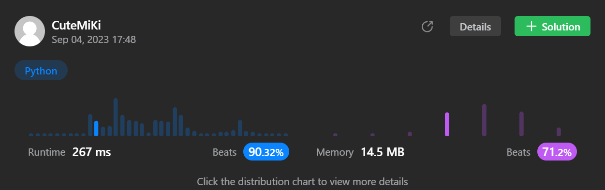

# 875. Koko Eating Bananas
### Tag: [Medium](https://github.com/TheOnlyMiki/LeetCode-For-Fun/tree/main#medium-level), [Array](https://github.com/TheOnlyMiki/LeetCode-For-Fun/tree/main#array), [Binary Search](https://github.com/TheOnlyMiki/LeetCode-For-Fun/tree/main#binary-search), [Math](https://github.com/TheOnlyMiki/LeetCode-For-Fun/tree/main#math)
---
<div class="px-5 pt-4"><div class="flex"></div><div class="xFUwe" data-track-load="description_content"><p>Koko loves to eat bananas. There are <code>n</code> piles of bananas, the <code>i<sup>th</sup></code> pile has <code>piles[i]</code> bananas. The guards have gone and will come back in <code>h</code> hours.</p>

<p>Koko can decide her bananas-per-hour eating speed of <code>k</code>. Each hour, she chooses some pile of bananas and eats <code>k</code> bananas from that pile. If the pile has less than <code>k</code> bananas, she eats all of them instead and will not eat any more bananas during this hour.</p>

<p>Koko likes to eat slowly but still wants to finish eating all the bananas before the guards return.</p>

<p>Return <em>the minimum integer</em> <code>k</code> <em>such that she can eat all the bananas within</em> <code>h</code> <em>hours</em>.</p>

<p>&nbsp;</p>
<p><strong class="example">Example 1:</strong></p>

<pre><strong>Input:</strong> piles = [3,6,7,11], h = 8
<strong>Output:</strong> 4
</pre>

<p><strong class="example">Example 2:</strong></p>

<pre><strong>Input:</strong> piles = [30,11,23,4,20], h = 5
<strong>Output:</strong> 30
</pre>

<p><strong class="example">Example 3:</strong></p>

<pre><strong>Input:</strong> piles = [30,11,23,4,20], h = 6
<strong>Output:</strong> 23
</pre>

<p>&nbsp;</p>
<p><strong>Constraints:</strong></p>

<ul>
	<li><code>1 &lt;= piles.length &lt;= 10<sup>4</sup></code></li>
	<li><code>piles.length &lt;= h &lt;= 10<sup>9</sup></code></li>
	<li><code>1 &lt;= piles[i] &lt;= 10<sup>9</sup></code></li>
</ul>
</div></div>

---


### Solution

```python
class Solution(object):
    def minEatingSpeed(self, piles, h):
        """
        :type piles: List[int]
        :type h: int
        :rtype: int
        """
        left, right = 1, max(piles)
        if len(piles) == h:
            return right

        def checkSpeed(speed):
            return sum((pile-1)//speed+1 for pile in piles) <= h

        temp = None
        while left < right:
            temp = (right + left) // 2
            if checkSpeed(temp):
                right = temp
            else:
                left = temp+1

        return left
```
