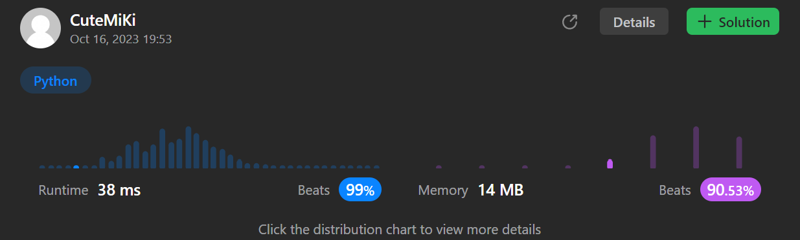

# 905. Sort Array By Parity
### Tag: [Easy](https://github.com/TheOnlyMiki/LeetCode-For-Fun/tree/main#easy-level), [Array](https://github.com/TheOnlyMiki/LeetCode-For-Fun/tree/main#array), [Two Pointers](https://github.com/TheOnlyMiki/LeetCode-For-Fun/tree/main#two-pointers), [Sorting](https://github.com/TheOnlyMiki/LeetCode-For-Fun/tree/main#sorting)
---
<div class="px-5 pt-4"><div class="flex"></div><div class="xFUwe" data-track-load="description_content"><p>Given an integer array <code>nums</code>, move all the even integers at the beginning of the array followed by all the odd integers.</p>

<p>Return <em><strong>any array</strong> that satisfies this condition</em>.</p>

<p>&nbsp;</p>
<p><strong class="example">Example 1:</strong></p>

<pre><strong>Input:</strong> nums = [3,1,2,4]
<strong>Output:</strong> [2,4,3,1]
<strong>Explanation:</strong> The outputs [4,2,3,1], [2,4,1,3], and [4,2,1,3] would also be accepted.
</pre>

<p><strong class="example">Example 2:</strong></p>

<pre><strong>Input:</strong> nums = [0]
<strong>Output:</strong> [0]
</pre>

<p>&nbsp;</p>
<p><strong>Constraints:</strong></p>

<ul>
	<li><code>1 &lt;= nums.length &lt;= 5000</code></li>
	<li><code>0 &lt;= nums[i] &lt;= 5000</code></li>
</ul>
</div></div>

---


### Solution

```python
class Solution(object):
    def sortArrayByParity(self, nums):
        """
        :type nums: List[int]
        :rtype: List[int]
        """
        left, right = 0, len(nums)-1
        while left < right:
            while left < right and nums[left] & 1 == 0:
                left += 1

            while left < right and nums[right] & 1 == 1:
                right -= 1

            if left < right:
                nums[left], nums[right] = nums[right], nums[left]
                left, right = left+1, right-1

        return nums
```
