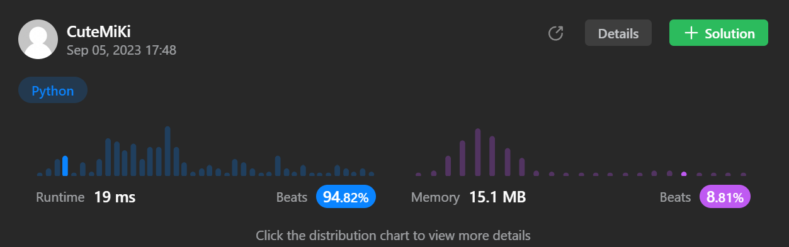

# 920. Number of Music Playlists
### Tag: [Hard](https://github.com/TheOnlyMiki/LeetCode-For-Fun/tree/main#hard-level), [Math](https://github.com/TheOnlyMiki/LeetCode-For-Fun/tree/main#math), [Dynamic Programming](https://github.com/TheOnlyMiki/LeetCode-For-Fun/tree/main#dynamic-programming)
---
<div class="px-5 pt-4"><div class="flex"></div><div class="xFUwe" data-track-load="description_content"><p>Your music player contains <code>n</code> different songs. You want to listen to <code>goal</code> songs (not necessarily different) during your trip. To avoid boredom, you will create a playlist so that:</p>

<ul>
	<li>Every song is played <strong>at least once</strong>.</li>
	<li>A song can only be played again only if <code>k</code> other songs have been played.</li>
</ul>

<p>Given <code>n</code>, <code>goal</code>, and <code>k</code>, return <em>the number of possible playlists that you can create</em>. Since the answer can be very large, return it <strong>modulo</strong> <code>10<sup>9</sup> + 7</code>.</p>
<p>&nbsp;</p>
<p><strong class="example">Example 1:</strong></p>

<pre><strong>Input:</strong> n = 3, goal = 3, k = 1
<strong>Output:</strong> 6
<strong>Explanation:</strong> There are 6 possible playlists: [1, 2, 3], [1, 3, 2], [2, 1, 3], [2, 3, 1], [3, 1, 2], and [3, 2, 1].
</pre>

<p><strong class="example">Example 2:</strong></p>

<pre><strong>Input:</strong> n = 2, goal = 3, k = 0
<strong>Output:</strong> 6
<strong>Explanation:</strong> There are 6 possible playlists: [1, 1, 2], [1, 2, 1], [2, 1, 1], [2, 2, 1], [2, 1, 2], and [1, 2, 2].
</pre>

<p><strong class="example">Example 3:</strong></p>

<pre><strong>Input:</strong> n = 2, goal = 3, k = 1
<strong>Output:</strong> 2
<strong>Explanation:</strong> There are 2 possible playlists: [1, 2, 1] and [2, 1, 2].
</pre>

<p>&nbsp;</p>
<p><strong>Constraints:</strong></p>

<ul>
	<li><code>0 &lt;= k &lt; n &lt;= goal &lt;= 100</code></li>
</ul>
</div></div>

---


### Solution

```python
class Solution(object):
    def numMusicPlaylists(self, n, goal, k):
        """
        :type n: int
        :type goal: int
        :type k: int
        :rtype: int
        """
        # Option 2
        if n > goal:
            return 0

        record = {}
        mod = 10**9 + 7

        def getNumMP1(i, song):
            if i == goal:
                return 1 if song == goal else 0

            return (n - song) * getNumMP1(i+1, song+1) % mod

        def getNumMP2(i, song):
            if i == goal:
                return 1 if song == n else 0

            if (i, song) in record:
                return record[(i, song)]

            temp = 0
            if song < n:
                temp += (n - song) * getNumMP2(i+1, song+1)
            if song > k:
                temp += (song - k) * getNumMP2(i+1, song)

            temp %= mod
            record[(i, song)] = temp % mod
            return temp

        if n == goal:
            return getNumMP1(0, 0)
        else:
            return getNumMP2(0, 0)

        # Option 1 - Cannot pass, it was BF method
        """
        if n > goal:
            return 0
            
        self.output = 0
        record = set()
        iteration = range(1, n+1)
        count = { num:0 for num in iteration }
        self.row = []

        def getNumMP1(i):
            if i == goal:
                self.output += 1
                return 

            for n in iteration:
                if n not in record:
                    record.add(n)
                    self.row.append(n)
                    getNumMP1(i+1)
                    self.row.pop()
                    record.discard(n)

        def getNumMP2(i):
            if i == goal:
                for n in iteration:
                    if count[n] == 0:
                        return

                self.output += 1
                return 

            if i > k:
                temp = self.row[i-k-1]
                record.discard(temp)

                for n in iteration:
                    if n not in record:
                        record.add(n)
                        self.row.append(n)
                        count[n] += 1
                        getNumMP2(i+1)
                        count[n] -= 1
                        self.row.pop()
                        record.discard(n)

                record.add(temp)
            else:
                for n in iteration:
                    if n not in record:
                        record.add(n)
                        self.row.append(n)
                        count[n] += 1
                        getNumMP2(i+1)
                        count[n] -= 1
                        self.row.pop()
                        record.discard(n)

        if n == goal:
            getNumMP1(0)
        else:
            getNumMP2(0)

        return self.output
        """
```
