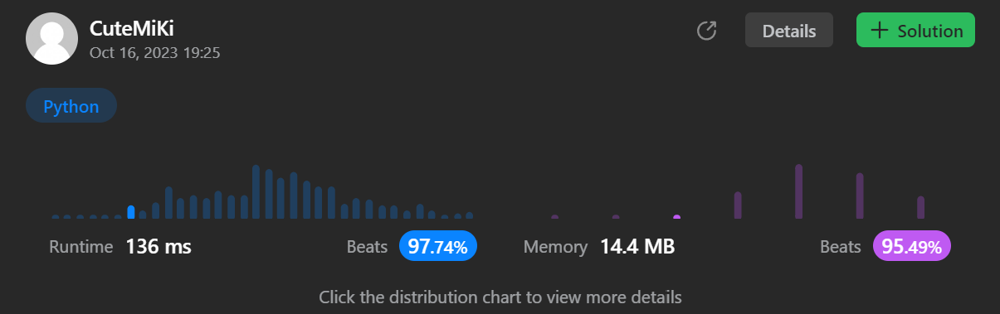

# 941. Valid Mountain Array
### Tag: [Easy](https://github.com/TheOnlyMiki/LeetCode-For-Fun/tree/main#easy-level), [Array](https://github.com/TheOnlyMiki/LeetCode-For-Fun/tree/main#array)
---
<div class="px-5 pt-4"><div class="flex"></div><div class="xFUwe" data-track-load="description_content"><p>Given an array of integers <code>arr</code>, return <em><code>true</code> if and only if it is a valid mountain array</em>.</p>

<p>Recall that arr is a mountain array if and only if:</p>

<ul>
	<li><code>arr.length &gt;= 3</code></li>
	<li>There exists some <code>i</code> with <code>0 &lt; i &lt; arr.length - 1</code> such that:
	<ul>
		<li><code>arr[0] &lt; arr[1] &lt; ... &lt; arr[i - 1] &lt; arr[i] </code></li>
		<li><code>arr[i] &gt; arr[i + 1] &gt; ... &gt; arr[arr.length - 1]</code></li>
	</ul>
	</li>
</ul>

<p>&nbsp;</p>
<p><strong class="example">Example 1:</strong></p>
<pre><strong>Input:</strong> arr = [2,1]
<strong>Output:</strong> false
</pre><p><strong class="example">Example 2:</strong></p>
<pre><strong>Input:</strong> arr = [3,5,5]
<strong>Output:</strong> false
</pre><p><strong class="example">Example 3:</strong></p>
<pre><strong>Input:</strong> arr = [0,3,2,1]
<strong>Output:</strong> true
</pre>
<p>&nbsp;</p>
<p><strong>Constraints:</strong></p>

<ul>
	<li><code>1 &lt;= arr.length &lt;= 10<sup>4</sup></code></li>
	<li><code>0 &lt;= arr[i] &lt;= 10<sup>4</sup></code></li>
</ul>
</div></div>

---


### Solution

```python
class Solution(object):
    def validMountainArray(self, arr):
        """
        :type arr: List[int]
        :rtype: bool
        """
        if len(arr) < 3:
            return False

        decrease = 0
        for i in range(1, len(arr)):
            if arr[i] <= arr[i-1]:
                decrease = i-1
                break

        if decrease == 0 or decrease == len(arr)-1:
            return False

        for i in range(decrease+1, len(arr)):
            if arr[i] >= arr[i-1]:
                return False

        return True
```
