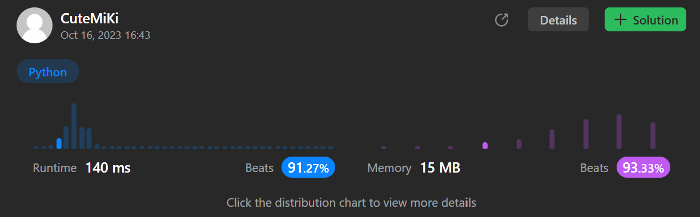

# 977. Squares of a Sorted Array
### Tag: [Easy](https://github.com/TheOnlyMiki/LeetCode-For-Fun/tree/main#easy-level), [Array](https://github.com/TheOnlyMiki/LeetCode-For-Fun/tree/main#array), [Two Pointers](https://github.com/TheOnlyMiki/LeetCode-For-Fun/tree/main#two-pointers), [Sorting](https://github.com/TheOnlyMiki/LeetCode-For-Fun/tree/main#sorting)
---
<div class="px-5 pt-4"><div class="flex"></div><div class="xFUwe" data-track-load="description_content"><p>Given an integer array <code>nums</code> sorted in <strong>non-decreasing</strong> order, return <em>an array of <strong>the squares of each number</strong> sorted in non-decreasing order</em>.</p>

<p>&nbsp;</p>
<p><strong class="example">Example 1:</strong></p>

<pre><strong>Input:</strong> nums = [-4,-1,0,3,10]
<strong>Output:</strong> [0,1,9,16,100]
<strong>Explanation:</strong> After squaring, the array becomes [16,1,0,9,100].
After sorting, it becomes [0,1,9,16,100].
</pre>

<p><strong class="example">Example 2:</strong></p>

<pre><strong>Input:</strong> nums = [-7,-3,2,3,11]
<strong>Output:</strong> [4,9,9,49,121]
</pre>

<p>&nbsp;</p>
<p><strong>Constraints:</strong></p>

<ul>
	<li><code><span>1 &lt;= nums.length &lt;= </span>10<sup>4</sup></code></li>
	<li><code>-10<sup>4</sup> &lt;= nums[i] &lt;= 10<sup>4</sup></code></li>
	<li><code>nums</code> is sorted in <strong>non-decreasing</strong> order.</li>
</ul>

<p>&nbsp;</p>
<strong>Follow up:</strong> Squaring each element and sorting the new array is very trivial, could you find an <code>O(n)</code> solution using a different approach?</div></div>

---


### Solution

```python
class Solution(object):
    def sortedSquares(self, nums):
        """
        :type nums: List[int]
        :rtype: List[int]
        """
        for i, num in enumerate(nums):
            nums[i] *= num

        nums.sort()
        return nums
```
