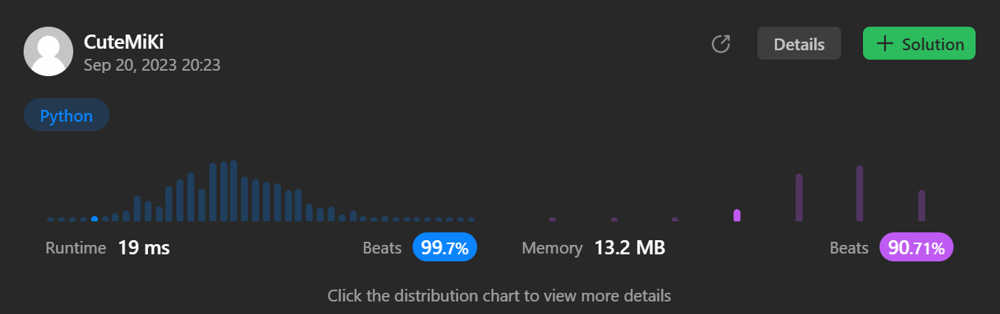

# 994. Rotting Oranges
### Tag: [Medium](https://github.com/TheOnlyMiki/LeetCode-For-Fun/tree/main#medium-level), [Array](https://github.com/TheOnlyMiki/LeetCode-For-Fun/tree/main#array), [Breadth-First Search](https://github.com/TheOnlyMiki/LeetCode-For-Fun/tree/main#breadth-first-search), [Matrix](https://github.com/TheOnlyMiki/LeetCode-For-Fun/tree/main#matrix)
---
<div class="px-5 pt-4"><div class="flex"></div><div class="xFUwe" data-track-load="description_content"><p>You are given an <code>m x n</code> <code>grid</code> where each cell can have one of three values:</p>

<ul>
	<li><code>0</code> representing an empty cell,</li>
	<li><code>1</code> representing a fresh orange, or</li>
	<li><code>2</code> representing a rotten orange.</li>
</ul>

<p>Every minute, any fresh orange that is <strong>4-directionally adjacent</strong> to a rotten orange becomes rotten.</p>

<p>Return <em>the minimum number of minutes that must elapse until no cell has a fresh orange</em>. If <em>this is impossible, return</em> <code>-1</code>.</p>

<p>&nbsp;</p>
<p><strong class="example">Example 1:</strong></p>

<pre><strong>Input:</strong> grid = [[2,1,1],[1,1,0],[0,1,1]]
<strong>Output:</strong> 4
</pre>

<p><strong class="example">Example 2:</strong></p>

<pre><strong>Input:</strong> grid = [[2,1,1],[0,1,1],[1,0,1]]
<strong>Output:</strong> -1
<strong>Explanation:</strong> The orange in the bottom left corner (row 2, column 0) is never rotten, because rotting only happens 4-directionally.
</pre>

<p><strong class="example">Example 3:</strong></p>

<pre><strong>Input:</strong> grid = [[0,2]]
<strong>Output:</strong> 0
<strong>Explanation:</strong> Since there are already no fresh oranges at minute 0, the answer is just 0.
</pre>

<p>&nbsp;</p>
<p><strong>Constraints:</strong></p>

<ul>
	<li><code>m == grid.length</code></li>
	<li><code>n == grid[i].length</code></li>
	<li><code>1 &lt;= m, n &lt;= 10</code></li>
	<li><code>grid[i][j]</code> is <code>0</code>, <code>1</code>, or <code>2</code>.</li>
</ul>
</div></div>

---


### Solution

```python
class Solution(object):
    def orangesRotting(self, grid):
        """
        :type grid: List[List[int]]
        :rtype: int
        """
        row, col = len(grid), len(grid[0])
        fresh = 0
        step = 0
        cols = range(col)
        moves = [(0,1), (1,0), (0,-1), (-1,0)]
        record = []
        
        for i in range(row):
            for j in cols:
                if grid[i][j] == 2:
                    record.append((i, j))
                if grid[i][j] == 1:
                    fresh += 1

        while record and fresh != 0:
            temp = []
            for x, y in record:
                for new_x, new_y in moves:
                    new_x, new_y = x + new_x, y + new_y
                    if -1 < new_x < row and -1 < new_y < col and grid[new_x][new_y] == 1:
                        grid[new_x][new_y] = 2
                        temp.append((new_x, new_y))

            fresh -= len(temp)
            step += 1
            record = temp
        
        return step if fresh == 0 else -1
```
