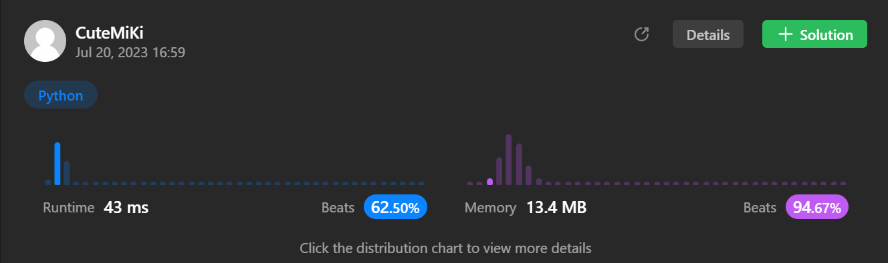

# 6. Zigzag Conversion
### Tag: [Medium](https://github.com/TheOnlyMiki/LeetCode-For-Fun/tree/main#medium-level), [String](https://github.com/TheOnlyMiki/LeetCode-For-Fun/tree/main#string)
---
<div class="px-5 pt-4"><div class="flex"></div><div class="_1l1MA" data-track-load="description_content"><p>The string <code>"PAYPALISHIRING"</code> is written in a zigzag pattern on a given number of rows like this: (you may want to display this pattern in a fixed font for better legibility)</p>

<pre>P   A   H   N
A P L S I I G
Y   I   R
</pre>

<p>And then read line by line: <code>"PAHNAPLSIIGYIR"</code></p>

<p>Write the code that will take a string and make this conversion given a number of rows:</p>

<pre>string convert(string s, int numRows);
</pre>

<p>&nbsp;</p>
<p><strong class="example">Example 1:</strong></p>

<pre><strong>Input:</strong> s = "PAYPALISHIRING", numRows = 3
<strong>Output:</strong> "PAHNAPLSIIGYIR"
</pre>

<p><strong class="example">Example 2:</strong></p>

<pre><strong>Input:</strong> s = "PAYPALISHIRING", numRows = 4
<strong>Output:</strong> "PINALSIGYAHRPI"
<strong>Explanation:</strong>
P     I    N
A   L S  I G
Y A   H R
P     I
</pre>

<p><strong class="example">Example 3:</strong></p>

<pre><strong>Input:</strong> s = "A", numRows = 1
<strong>Output:</strong> "A"
</pre>

<p>&nbsp;</p>
<p><strong>Constraints:</strong></p>

<ul>
	<li><code>1 &lt;= s.length &lt;= 1000</code></li>
	<li><code>s</code> consists of English letters (lower-case and upper-case), <code>','</code> and <code>'.'</code>.</li>
	<li><code>1 &lt;= numRows &lt;= 1000</code></li>
</ul>
</div></div>

---


### Solution

```python
class Solution(object):
    def convert(self, s, numRows):
        """
        :type s: str
        :type numRows: int
        :rtype: str
        """
        if numRows == 1:
            return s

        #Option 2
        count = [ "" for _ in range(numRows) ]
        index_shift = 1
        i = 0
        index_return = numRows-1

        for c in s:
            count[i] += c
            if i == 0:
                index_shift = 1
            elif i == index_return:
                index_shift = -1
            i+=index_shift

        return "".join(count)

        #Option 1
        """
        index_0 = numRows + numRows - 2
        count = [ "" for _ in range(numRows) ]
        index_shift = 0

        for i, c in enumerate(s):
            index = i % index_0
            if index == 0:
                count[0] += c
                index_shift = numRows - 2
            elif index < numRows:
                count[index] += c
            else:
                count[index_shift] += c
                index_shift-=1

        return "".join(count)
        """
```
