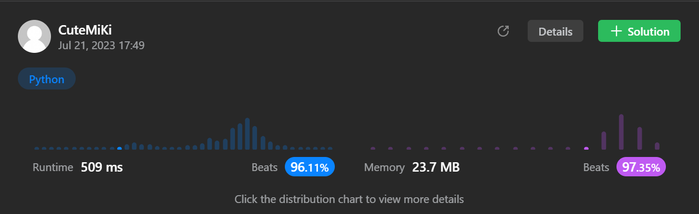

# 11. Container With Most Water
### Tag: [Medium](https://github.com/TheOnlyMiki/LeetCode-For-Fun/tree/main#medium-level), [Array](https://github.com/TheOnlyMiki/LeetCode-For-Fun/tree/main#array), [Two Pointers](https://github.com/TheOnlyMiki/LeetCode-For-Fun/tree/main#two-pointers), [Greedy](https://github.com/TheOnlyMiki/LeetCode-For-Fun/tree/main#greedy)
---
<div class="px-5 pt-4"><div class="flex"></div><div class="_1l1MA" data-track-load="description_content"><p>You are given an integer array <code>height</code> of length <code>n</code>. There are <code>n</code> vertical lines drawn such that the two endpoints of the <code>i<sup>th</sup></code> line are <code>(i, 0)</code> and <code>(i, height[i])</code>.</p>

<p>Find two lines that together with the x-axis form a container, such that the container contains the most water.</p>

<p>Return <em>the maximum amount of water a container can store</em>.</p>

<p><strong>Notice</strong> that you may not slant the container.</p>

<p>&nbsp;</p>
<p><strong class="example">Example 1:</strong></p>

<pre><strong>Input:</strong> height = [1,8,6,2,5,4,8,3,7]
<strong>Output:</strong> 49
<strong>Explanation:</strong> The above vertical lines are represented by array [1,8,6,2,5,4,8,3,7]. In this case, the max area of water (blue section) the container can contain is 49.
</pre>

<p><strong class="example">Example 2:</strong></p>

<pre><strong>Input:</strong> height = [1,1]
<strong>Output:</strong> 1
</pre>

<p>&nbsp;</p>
<p><strong>Constraints:</strong></p>

<ul>
	<li><code>n == height.length</code></li>
	<li><code>2 &lt;= n &lt;= 10<sup>5</sup></code></li>
	<li><code>0 &lt;= height[i] &lt;= 10<sup>4</sup></code></li>
</ul>
</div></div>

---


### Solution

```python
class Solution(object):
    def maxArea(self, height):
        """
        :type height: List[int]
        :rtype: int
        """

        distance = len(height) - 1
        left = 0
        right = distance
        max_record = 0
        higher = max(height)

        while left < right:
            area = min(height[left], height[right]) * distance
            if max_record < area:
                max_record = area
            
            if higher * distance < max_record:
                return max_record

            # Initial next iteration
            if height[left] > height[right]:
                right -= 1
            else:
                left += 1
            distance -=1

        return max_record
```
