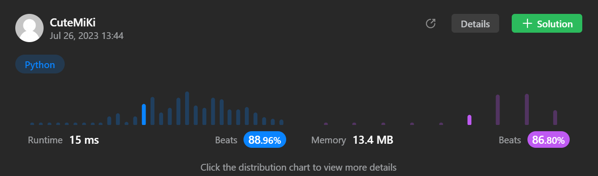

# 14. Longest Common Prefix
### Tag: [Easy](https://github.com/TheOnlyMiki/LeetCode-For-Fun/tree/main#easy-level), [String](https://github.com/TheOnlyMiki/LeetCode-For-Fun/tree/main#string)
---
<div class="px-5 pt-4"><div class="flex"></div><div class="_1l1MA" data-track-load="description_content"><p>Write a function to find the longest common prefix string amongst an array of strings.</p>

<p>If there is no common prefix, return an empty string <code>""</code>.</p>

<p>&nbsp;</p>
<p><strong class="example">Example 1:</strong></p>

<pre><strong>Input:</strong> strs = ["flower","flow","flight"]
<strong>Output:</strong> "fl"
</pre>

<p><strong class="example">Example 2:</strong></p>

<pre><strong>Input:</strong> strs = ["dog","racecar","car"]
<strong>Output:</strong> ""
<strong>Explanation:</strong> There is no common prefix among the input strings.
</pre>

<p>&nbsp;</p>
<p><strong>Constraints:</strong></p>

<ul>
	<li><code>1 &lt;= strs.length &lt;= 200</code></li>
	<li><code>0 &lt;= strs[i].length &lt;= 200</code></li>
	<li><code>strs[i]</code> consists of only lowercase English letters.</li>
</ul>
</div></div>

---


### Solution

```python
class Solution(object):
    def longestCommonPrefix(self, strs):
        """
        :type strs: List[str]
        :rtype: str
        """
        # Option 2
        first_s_length = len(strs[0])

        i = 0
        record = first_s_length
        range_remain_s = range(1, len(strs))

        while i < first_s_length:
            c = strs[0][i]

            for index in range_remain_s:
                if i == len(strs[index]) or strs[index][i] != c:
                    record = i
                    i = first_s_length
                    break

            i += 1

        return strs[0][:record]

        #Option 1
        """
        index = 200
        first_s_length = len(strs[0])

        for s in range(1,len(strs)):
            match = 0

            for i, c in enumerate(strs[s]):
                if i < first_s_length and strs[0][i] == c:
                    match+=1
                else:
                    break

            index = min(match, index)

        return strs[0][:index]
        """
```
