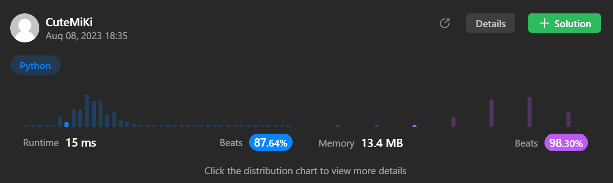

# 22. Generate Parentheses
### Tag: [Medium](https://github.com/TheOnlyMiki/LeetCode-For-Fun/tree/main#medium-level), [String](https://github.com/TheOnlyMiki/LeetCode-For-Fun/tree/main#string), [Dynamic Programming](https://github.com/TheOnlyMiki/LeetCode-For-Fun/tree/main#dynamic-programming), [Backtracking](https://github.com/TheOnlyMiki/LeetCode-For-Fun/tree/main#backtracking)
---
<div class="px-5 pt-4"><div class="flex"></div><div class="xFUwe" data-track-load="description_content"><p>Given <code>n</code> pairs of parentheses, write a function to <em>generate all combinations of well-formed parentheses</em>.</p>

<p>&nbsp;</p>
<p><strong class="example">Example 1:</strong></p>
<pre><strong>Input:</strong> n = 3
<strong>Output:</strong> ["((()))","(()())","(())()","()(())","()()()"]
</pre><p><strong class="example">Example 2:</strong></p>
<pre><strong>Input:</strong> n = 1
<strong>Output:</strong> ["()"]
</pre>
<p>&nbsp;</p>
<p><strong>Constraints:</strong></p>

<ul>
	<li><code>1 &lt;= n &lt;= 8</code></li>
</ul>
</div></div>

---


### Solution

```python
class Solution(object):
    def generateParenthesis(self, n):
        """
        :type n: int
        :rtype: List[str]
        """
        output = []
        condition = 2*n
        self.valid = 0
            
        def getNum(record):
            if len(record) == condition:
                if self.valid == 0:
                    output.append(record)
                return

            # Opreation '('
            if self.valid != n:
                self.valid += 1
                getNum(record + '(')
                self.valid -= 1
            
            # Opreation '}'
            if self.valid != 0:
                self.valid -= 1
                getNum(record + ')')
                self.valid += 1

        getNum("")

        return output
```
