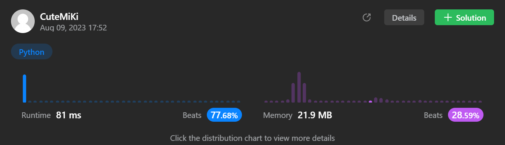

# 23. Merge k Sorted Lists
### Tag: [Hard](https://github.com/TheOnlyMiki/LeetCode-For-Fun/tree/main#hard-level), [Linked List](https://github.com/TheOnlyMiki/LeetCode-For-Fun/tree/main#linked-list), [Divide and Conquer](https://github.com/TheOnlyMiki/LeetCode-For-Fun/tree/main#divide-and-conquer)
---
<div class="px-5 pt-4"><div class="flex"></div><div class="xFUwe" data-track-load="description_content"><p>You are given an array of <code>k</code> linked-lists <code>lists</code>, each linked-list is sorted in ascending order.</p>

<p><em>Merge all the linked-lists into one sorted linked-list and return it.</em></p>

<p>&nbsp;</p>
<p><strong class="example">Example 1:</strong></p>

<pre><strong>Input:</strong> lists = [[1,4,5],[1,3,4],[2,6]]
<strong>Output:</strong> [1,1,2,3,4,4,5,6]
<strong>Explanation:</strong> The linked-lists are:
[
  1-&gt;4-&gt;5,
  1-&gt;3-&gt;4,
  2-&gt;6
]
merging them into one sorted list:
1-&gt;1-&gt;2-&gt;3-&gt;4-&gt;4-&gt;5-&gt;6
</pre>

<p><strong class="example">Example 2:</strong></p>

<pre><strong>Input:</strong> lists = []
<strong>Output:</strong> []
</pre>

<p><strong class="example">Example 3:</strong></p>

<pre><strong>Input:</strong> lists = [[]]
<strong>Output:</strong> []
</pre>

<p>&nbsp;</p>
<p><strong>Constraints:</strong></p>

<ul>
	<li><code>k == lists.length</code></li>
	<li><code>0 &lt;= k &lt;= 10<sup>4</sup></code></li>
	<li><code>0 &lt;= lists[i].length &lt;= 500</code></li>
	<li><code>-10<sup>4</sup> &lt;= lists[i][j] &lt;= 10<sup>4</sup></code></li>
	<li><code>lists[i]</code> is sorted in <strong>ascending order</strong>.</li>
	<li>The sum of <code>lists[i].length</code> will not exceed <code>10<sup>4</sup></code>.</li>
</ul>
</div></div>

---


### Solution

```python
# Definition for singly-linked list.
# class ListNode(object):
#     def __init__(self, val=0, next=None):
#         self.val = val
#         self.next = next
import heapq

class MyNode(object):
    def __init__(self, val, node):
        self.val = val
        self.node = node
    
    def __lt__(self, other):
        return self.val < other.val

    #def __repr__(self):
        #return 'Node value: ' + str(self.val)

class Solution(object):
    def mergeKLists(self, lists):
        """
        :type lists: List[ListNode]
        :rtype: ListNode
        """
        
        heap = []
        for node in lists:
            if node:
                heapq.heappush(heap, MyNode(node.val, node))
        
        if not heap:
            return None
        
        head = current = heapq.heappop(heap).node
        if head.next:
            heapq.heappush(heap, MyNode(head.next.val, head.next))

        temp = None
        while heap:
            temp = heapq.heappop(heap).node
            if temp.next:
                heapq.heappush(heap, MyNode(temp.next.val, temp.next))
            current.next = temp
            current = temp

        return head
```
