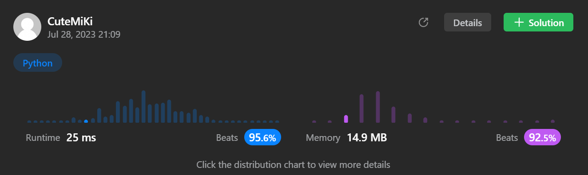

# 25. Reverse Nodes in k-Group
### Tag: [Hard](https://github.com/TheOnlyMiki/LeetCode-For-Fun/tree/main#hard-level), [Linked List](https://github.com/TheOnlyMiki/LeetCode-For-Fun/tree/main#linked-list)
---
<div class="px-5 pt-4"><div class="flex"></div><div class="_1l1MA" data-track-load="description_content"><p>Given the <code>head</code> of a linked list, reverse the nodes of the list <code>k</code> at a time, and return <em>the modified list</em>.</p>

<p><code>k</code> is a positive integer and is less than or equal to the length of the linked list. If the number of nodes is not a multiple of <code>k</code> then left-out nodes, in the end, should remain as it is.</p>

<p>You may not alter the values in the list's nodes, only nodes themselves may be changed.</p>

<p>&nbsp;</p>
<p><strong class="example">Example 1:</strong></p>

<pre><strong>Input:</strong> head = [1,2,3,4,5], k = 2
<strong>Output:</strong> [2,1,4,3,5]
</pre>

<p><strong class="example">Example 2:</strong></p>

<pre><strong>Input:</strong> head = [1,2,3,4,5], k = 3
<strong>Output:</strong> [3,2,1,4,5]
</pre>

<p>&nbsp;</p>
<p><strong>Constraints:</strong></p>

<ul>
	<li>The number of nodes in the list is <code>n</code>.</li>
	<li><code>1 &lt;= k &lt;= n &lt;= 5000</code></li>
	<li><code>0 &lt;= Node.val &lt;= 1000</code></li>
</ul>

<p>&nbsp;</p>
<p><strong>Follow-up:</strong> Can you solve the problem in <code>O(1)</code> extra memory space?</p>
</div></div>

---


### Solution

```python
# Definition for singly-linked list.
# class ListNode(object):
#     def __init__(self, val=0, next=None):
#         self.val = val
#         self.next = next
class Solution(object):
    def reverseOperation(self, record, end):
        start = record.next
        record.next = end
        return start, record

    def reverseKGroup(self, head, k):
        """
        :type head: ListNode
        :type k: int
        :rtype: ListNode
        """
        # 1 -> 2 -> 3, let's say we at 2
        # start for recording the address of 3
        # end for recording the address 2 itself
        start = None
        end = None
        i = 0
        record = head
        
        # Find a head for result, and why not just reversing during this period?
        while record and i < k:
            record, end = self.reverseOperation(record, end)
            i += 1

        node_may_reverse_back = end
        result_head = end
        connect_node = None
        output_head = head
        
        while record:
            i = 0
            connect_node = record
            end = None

            while record and i < k:
                record, end = self.reverseOperation(record, end)
                i += 1

            node_may_reverse_back = output_head
            output_head.next = end
            output_head = connect_node

        if 1 < i < k:
            record = end
            start = end = None
            while record and i > 0:
                record, end = self.reverseOperation(record, end)
                i -= 1
            node_may_reverse_back.next = end

        return result_head
```
