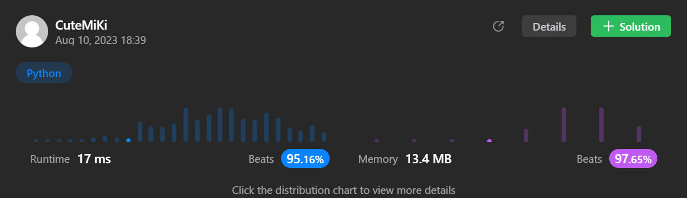

# 33. Search in Rotated Sorted Array
### Tag: [Medium](https://github.com/TheOnlyMiki/LeetCode-For-Fun/tree/main#medium-level), [Array](https://github.com/TheOnlyMiki/LeetCode-For-Fun/tree/main#array), [Binary Search](https://github.com/TheOnlyMiki/LeetCode-For-Fun/tree/main#binary-search)
---
<div class="px-5 pt-4"><div class="flex"></div><div class="xFUwe" data-track-load="description_content"><p>There is an integer array <code>nums</code> sorted in ascending order (with <strong>distinct</strong> values).</p>

<p>Prior to being passed to your function, <code>nums</code> is <strong>possibly rotated</strong> at an unknown pivot index <code>k</code> (<code>1 &lt;= k &lt; nums.length</code>) such that the resulting array is <code>[nums[k], nums[k+1], ..., nums[n-1], nums[0], nums[1], ..., nums[k-1]]</code> (<strong>0-indexed</strong>). For example, <code>[0,1,2,4,5,6,7]</code> might be rotated at pivot index <code>3</code> and become <code>[4,5,6,7,0,1,2]</code>.</p>

<p>Given the array <code>nums</code> <strong>after</strong> the possible rotation and an integer <code>target</code>, return <em>the index of </em><code>target</code><em> if it is in </em><code>nums</code><em>, or </em><code>-1</code><em> if it is not in </em><code>nums</code>.</p>

<p>You must write an algorithm with <code>O(log n)</code> runtime complexity.</p>

<p>&nbsp;</p>
<p><strong class="example">Example 1:</strong></p>
<pre><strong>Input:</strong> nums = [4,5,6,7,0,1,2], target = 0
<strong>Output:</strong> 4
</pre><p><strong class="example">Example 2:</strong></p>
<pre><strong>Input:</strong> nums = [4,5,6,7,0,1,2], target = 3
<strong>Output:</strong> -1
</pre><p><strong class="example">Example 3:</strong></p>
<pre><strong>Input:</strong> nums = [1], target = 0
<strong>Output:</strong> -1
</pre>
<p>&nbsp;</p>
<p><strong>Constraints:</strong></p>

<ul>
	<li><code>1 &lt;= nums.length &lt;= 5000</code></li>
	<li><code>-10<sup>4</sup> &lt;= nums[i] &lt;= 10<sup>4</sup></code></li>
	<li>All values of <code>nums</code> are <strong>unique</strong>.</li>
	<li><code>nums</code> is an ascending array that is possibly rotated.</li>
	<li><code>-10<sup>4</sup> &lt;= target &lt;= 10<sup>4</sup></code></li>
</ul>
</div></div>

---


### Solution

```python
class Solution(object):
    def search(self, nums, target):
        """
        :type nums: List[int]
        :type target: int
        :rtype: int
        """
        # Option 3 - Find out the rotated index
        length = len(nums) - 1
        if length == 0:
            return 0 if target == nums[0] else -1

        left, right = 0, length
        mid = current = None

        if nums[left] > nums[right]:
            while left <= right:
                mid = (left + right) // 2
                if nums[mid] >= nums[right]:
                    left = mid+1
                else:
                    right = mid

            left, right = (right, length) if nums[length] >= target else (0, right-1)

        while left <= right:
            mid = (left + right) // 2
            current = nums[mid]
            if target < current:
                right = mid-1
            elif target > current:
                left = mid+1
            else:
                return mid

        return -1

        # Option 2 - Binary search
        """
        length = len(nums) - 1
        if length == 0:
            return 0 if target == nums[0] else -1

        left, right = 0, length
        current = None

        while left <= right:
            mid = (left + right) // 2
            current = nums[mid]
            if current == target:
                return mid
            if current >= nums[left]:
                if target >= nums[left] and target < current:
                    right = mid-1
                else:
                    left = mid+1
            else:
                if target <= nums[right] and target > current:
                    left = mid+1
                else:
                    right = mid-1

        return -1
        """

        # Option 1 - Bad design binary search, slowly
        """
        length = len(nums) - 1
        if length == 0:
            return 0 if target == nums[0] else -1

        left, right = 0, length
        current = None
        rotated = True if nums[left] > nums[right] else False

        while left <= right:
            mid = (left + right) // 2
            current = nums[mid]
            if target < current:
                # Rotated List
                if rotated:
                    if current <= nums[right]:
                        right = mid-1
                    elif target <= nums[right]:
                        left = mid+1
                        continue
                # Not Rotated List
                right = mid-1
            elif target > current:
                # Rotated List
                if rotated:
                    if nums[left] <= current:
                        left = mid+1
                    elif target >= nums[left]:
                        right = mid-1
                        continue
                # Not Rotated List
                left = mid+1
            else:
                return mid

        return -1
        """
```
