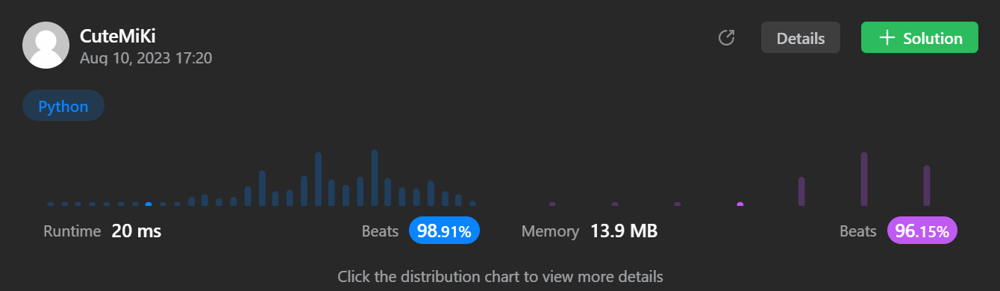

# 35. Search Insert Position
### Tag: [Easy](https://github.com/TheOnlyMiki/LeetCode-For-Fun/tree/main#easy-level), [Array](https://github.com/TheOnlyMiki/LeetCode-For-Fun/tree/main#array), [Binary Search](https://github.com/TheOnlyMiki/LeetCode-For-Fun/tree/main#binary-search)
---
<div class="px-5 pt-4"><div class="flex"></div><div class="xFUwe" data-track-load="description_content"><p>Given a sorted array of distinct integers and a target value, return the index if the target is found. If not, return the index where it would be if it were inserted in order.</p>

<p>You must&nbsp;write an algorithm with&nbsp;<code>O(log n)</code> runtime complexity.</p>

<p>&nbsp;</p>
<p><strong class="example">Example 1:</strong></p>

<pre><strong>Input:</strong> nums = [1,3,5,6], target = 5
<strong>Output:</strong> 2
</pre>

<p><strong class="example">Example 2:</strong></p>

<pre><strong>Input:</strong> nums = [1,3,5,6], target = 2
<strong>Output:</strong> 1
</pre>

<p><strong class="example">Example 3:</strong></p>

<pre><strong>Input:</strong> nums = [1,3,5,6], target = 7
<strong>Output:</strong> 4
</pre>

<p>&nbsp;</p>
<p><strong>Constraints:</strong></p>

<ul>
	<li><code>1 &lt;= nums.length &lt;= 10<sup>4</sup></code></li>
	<li><code>-10<sup>4</sup> &lt;= nums[i] &lt;= 10<sup>4</sup></code></li>
	<li><code>nums</code> contains <strong>distinct</strong> values sorted in <strong>ascending</strong> order.</li>
	<li><code>-10<sup>4</sup> &lt;= target &lt;= 10<sup>4</sup></code></li>
</ul>
</div></div>

---


### Solution

```python
class Solution(object):
    def searchInsert(self, nums, target):
        """
        :type nums: List[int]
        :type target: int
        :rtype: int
        """
        # Option 2 - Binary Search, Or call devide and conquer
        left, right = 0, len(nums)
        if nums[right-1] < target:
            return right

        mid = temp = None
        while left <= right:
            mid = (left + right) // 2
            temp = nums[mid]
            if target < temp:
                right = mid-1
            elif target > temp:
                left = mid+1
            else:
                return mid

        return left

        # Option 1 - Linear Method
        """
        for i, num in enumerate(nums):
            if num >= target:
                return i

        return len(nums)
        """
```
