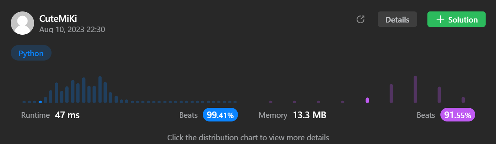

# 4. Median of Two Sorted Arrays
### Tag: [Easy](https://github.com/TheOnlyMiki/LeetCode-For-Fun/tree/main#easy-level), [Array](https://github.com/TheOnlyMiki/LeetCode-For-Fun/tree/main#array), [Divide and Conquer](https://github.com/TheOnlyMiki/LeetCode-For-Fun/tree/main#divide-and-conquer), [Binary Search](https://github.com/TheOnlyMiki/LeetCode-For-Fun/tree/main#binary-search)
---
<div class="px-5 pt-4"><div class="flex"></div><div class="xFUwe" data-track-load="description_content"><p>Given two sorted arrays <code>nums1</code> and <code>nums2</code> of size <code>m</code> and <code>n</code> respectively, return <strong>the median</strong> of the two sorted arrays.</p>

<p>The overall run time complexity should be <code>O(log (m+n))</code>.</p>

<p>&nbsp;</p>
<p><strong class="example">Example 1:</strong></p>

<pre><strong>Input:</strong> nums1 = [1,3], nums2 = [2]
<strong>Output:</strong> 2.00000
<strong>Explanation:</strong> merged array = [1,2,3] and median is 2.
</pre>

<p><strong class="example">Example 2:</strong></p>

<pre><strong>Input:</strong> nums1 = [1,2], nums2 = [3,4]
<strong>Output:</strong> 2.50000
<strong>Explanation:</strong> merged array = [1,2,3,4] and median is (2 + 3) / 2 = 2.5.
</pre>

<p>&nbsp;</p>
<p><strong>Constraints:</strong></p>

<ul>
	<li><code>nums1.length == m</code></li>
	<li><code>nums2.length == n</code></li>
	<li><code>0 &lt;= m &lt;= 1000</code></li>
	<li><code>0 &lt;= n &lt;= 1000</code></li>
	<li><code>1 &lt;= m + n &lt;= 2000</code></li>
	<li><code>-10<sup>6</sup> &lt;= nums1[i], nums2[i] &lt;= 10<sup>6</sup></code></li>
</ul>
</div></div>

---


### Solution

```python
class Solution(object):
    def findMedianSortedArrays(self, nums1, nums2):
        """
        :type nums1: List[int]
        :type nums2: List[int]
        :rtype: float
        """
        length1 = len(nums1)
        length2 = len(nums2)

        if length1 < length2:
            return self.findMedianSortedArrays(nums2, nums1)

        length = length1 + length2
        length1 *= 2
        length2 *= 2
        
        left, right = 0, length2
        mid1 = mid2 = None
        left1 = left2 = right1 = right2 = None

        while left <= right:
            mid1 = (left + right) // 2
            mid2 = length - mid1
            #print(left, right)
            #print(mid1, mid2)

            left1 = -10000000 if mid2 == 0 else nums1[(mid2-1)/2]
            right1 = 10000000 if mid2 == length1 else nums1[mid2/2]
            left2 = -10000000 if mid1 == 0 else nums2[(mid1-1)/2]
            right2 = 10000000 if mid1 == length2 else nums2[mid1/2]
            #print(left1, left2, right1, right2)

            if left1 > right2:
                left = mid1 + 1
            elif left2 > right1:
                right = mid1 - 1
            else:
                return (max(left1, left2) + min(right1, right2)) / 2.0

        return -1
```
