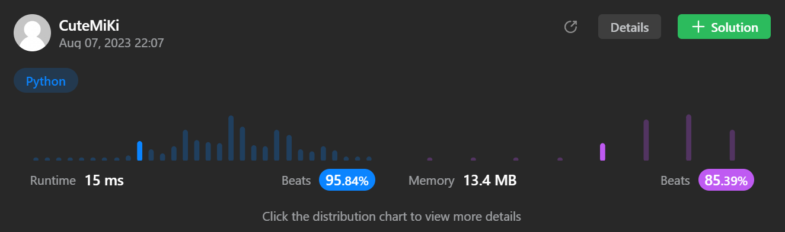

# 46. Permutations
### Tag: [Medium](https://github.com/TheOnlyMiki/LeetCode-For-Fun/tree/main#medium-level), [Array](https://github.com/TheOnlyMiki/LeetCode-For-Fun/tree/main#array), [Backtracking](https://github.com/TheOnlyMiki/LeetCode-For-Fun/tree/main#backtracking)
---
<div class="px-5 pt-4"><div class="flex"></div><div class="xFUwe" data-track-load="description_content"><p>Given an array <code>nums</code> of distinct integers, return <em>all the possible permutations</em>. You can return the answer in <strong>any order</strong>.</p>

<p>&nbsp;</p>
<p><strong class="example">Example 1:</strong></p>
<pre><strong>Input:</strong> nums = [1,2,3]
<strong>Output:</strong> [[1,2,3],[1,3,2],[2,1,3],[2,3,1],[3,1,2],[3,2,1]]
</pre><p><strong class="example">Example 2:</strong></p>
<pre><strong>Input:</strong> nums = [0,1]
<strong>Output:</strong> [[0,1],[1,0]]
</pre><p><strong class="example">Example 3:</strong></p>
<pre><strong>Input:</strong> nums = [1]
<strong>Output:</strong> [[1]]
</pre>
<p>&nbsp;</p>
<p><strong>Constraints:</strong></p>

<ul>
	<li><code>1 &lt;= nums.length &lt;= 6</code></li>
	<li><code>-10 &lt;= nums[i] &lt;= 10</code></li>
	<li>All the integers of <code>nums</code> are <strong>unique</strong>.</li>
</ul>
</div></div>

---


### Solution

```python
class Solution(object):
    def permute(self, nums):
        """
        :type nums: List[int]
        :rtype: List[List[int]]
        """
        length = len(nums)
        visit = set()
        output = []

        def getNum(record):
            if length == len(record):
                output.append(record[:])
                return

            for item in nums:
                if item not in visit:
                    visit.add(item)
                    record.append(item)
                    getNum(record)
                    record.pop()
                    visit.remove(item)

        getNum([])
        return output
```
