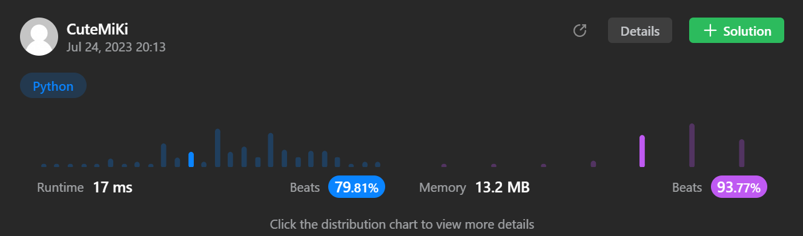

# 48. Rotate Image
### Tag: [Medium](https://github.com/TheOnlyMiki/LeetCode-For-Fun/tree/main#medium-level), [Array](https://github.com/TheOnlyMiki/LeetCode-For-Fun/tree/main#array), [Math](https://github.com/TheOnlyMiki/LeetCode-For-Fun/tree/main#math), [Matrix](https://github.com/TheOnlyMiki/LeetCode-For-Fun/tree/main#matrix)
---
<div class="px-5 pt-4"><div class="flex"></div><div class="_1l1MA" data-track-load="description_content"><p>You are given an <code>n x n</code> 2D <code>matrix</code> representing an image, rotate the image by <strong>90</strong> degrees (clockwise).</p>

<p>You have to rotate the image <a href="https://en.wikipedia.org/wiki/In-place_algorithm" target="_blank"><strong>in-place</strong></a>, which means you have to modify the input 2D matrix directly. <strong>DO NOT</strong> allocate another 2D matrix and do the rotation.</p>

<p>&nbsp;</p>
<p><strong class="example">Example 1:</strong></p>

<pre><strong>Input:</strong> matrix = [[1,2,3],[4,5,6],[7,8,9]]
<strong>Output:</strong> [[7,4,1],[8,5,2],[9,6,3]]
</pre>

<p><strong class="example">Example 2:</strong></p>

<pre><strong>Input:</strong> matrix = [[5,1,9,11],[2,4,8,10],[13,3,6,7],[15,14,12,16]]
<strong>Output:</strong> [[15,13,2,5],[14,3,4,1],[12,6,8,9],[16,7,10,11]]
</pre>

<p>&nbsp;</p>
<p><strong>Constraints:</strong></p>

<ul>
	<li><code>n == matrix.length == matrix[i].length</code></li>
	<li><code>1 &lt;= n &lt;= 20</code></li>
	<li><code>-1000 &lt;= matrix[i][j] &lt;= 1000</code></li>
</ul>
</div></div>

---


### Solution

```python
class Solution(object):
    def rotate(self, matrix):
        """
        :type matrix: List[List[int]]
        :rtype: None Do not return anything, modify matrix in-place instead.
        """
        col_len = len(matrix)
        row_len = len(matrix[0])
        m = col_len - 1
        n = row_len - 1

        for x in range(col_len//2):
            for y in range(row_len):
                temp = matrix[x][y]
                matrix[x][y] = matrix[m-x][y]
                matrix[m-x][y] = temp
        
        for x in range(col_len):
            for y in range(x, row_len):
                temp = matrix[x][y]
                matrix[x][y] = matrix[y][x]
                matrix[y][x] = temp

        #print(matrix)

        # Not in place method
        # Rotae 90
        """
        m = len(matrix) - 1
        n = len(matrix[0]) - 1

        temp_matrix = [ row[:] for row in matrix ]

        for x in range(len(matrix)):
            for y in range(len(matrix[0])):
                matrix[x][y] = temp_matrix[m-y][x]

        #print(matrix)
        """

        # Rotate 180
        """
        m = len(matrix) - 1
        n = len(matrix[0]) - 1

        temp_matrix = [ row[:] for row in matrix ]

        for x in range(len(matrix)):
            for y in range(len(matrix[0])):
                matrix[x][y] = temp_matrix[m-x][n-y]

        #print(matrix)
        """

        # Rotate -90
        """
        m = len(matrix) - 1
        n = len(matrix[0]) - 1

        temp_matrix = [ row[:] for row in matrix ]

        for x in range(len(matrix)):
            for y in range(len(matrix[0])):
                matrix[x][y] = temp_matrix[y][n-x]

        #print(matrix)
        """
```
