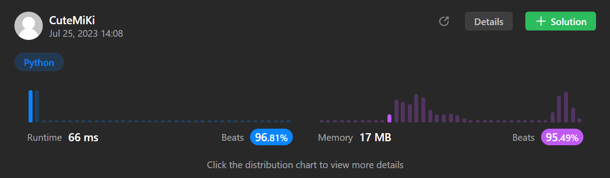

# 49. Group Anagrams
### Tag: [Medium](https://github.com/TheOnlyMiki/LeetCode-For-Fun/tree/main#medium-level), [Array](https://github.com/TheOnlyMiki/LeetCode-For-Fun/tree/main#array), [Hash Table](https://github.com/TheOnlyMiki/LeetCode-For-Fun/tree/main#hash-table), [String](https://github.com/TheOnlyMiki/LeetCode-For-Fun/tree/main#string), [Sorting](https://github.com/TheOnlyMiki/LeetCode-For-Fun/tree/main#sorting)
---
<div class="px-5 pt-4"><div class="flex"></div><div class="_1l1MA" data-track-load="description_content"><p>Given an array of strings <code>strs</code>, group <strong>the anagrams</strong> together. You can return the answer in <strong>any order</strong>.</p>

<p>An <strong>Anagram</strong> is a word or phrase formed by rearranging the letters of a different word or phrase, typically using all the original letters exactly once.</p>

<p>&nbsp;</p>
<p><strong class="example">Example 1:</strong></p>
<pre><strong>Input:</strong> strs = ["eat","tea","tan","ate","nat","bat"]
<strong>Output:</strong> [["bat"],["nat","tan"],["ate","eat","tea"]]
</pre><p><strong class="example">Example 2:</strong></p>
<pre><strong>Input:</strong> strs = [""]
<strong>Output:</strong> [[""]]
</pre><p><strong class="example">Example 3:</strong></p>
<pre><strong>Input:</strong> strs = ["a"]
<strong>Output:</strong> [["a"]]
</pre>
<p>&nbsp;</p>
<p><strong>Constraints:</strong></p>

<ul>
	<li><code>1 &lt;= strs.length &lt;= 10<sup>4</sup></code></li>
	<li><code>0 &lt;= strs[i].length &lt;= 100</code></li>
	<li><code>strs[i]</code> consists of lowercase English letters.</li>
</ul>
</div></div>

---


### Solution

```python
class Solution(object):
    def groupAnagrams(self, strs):
        """
        :type strs: List[str]
        :rtype: List[List[str]]
        """

        count = {}

        for word in strs:
            temp = "".join(sorted(word))
            if temp in count:
                count[temp].append(word)
            else:
                count[temp] = [word]

        return count.values()
```
