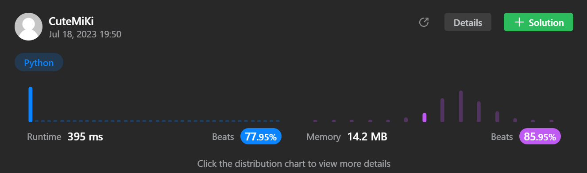

# 55. Jump Game
### Tag: [Medium](https://github.com/TheOnlyMiki/LeetCode-For-Fun/tree/main#medium-level), [Array](https://github.com/TheOnlyMiki/LeetCode-For-Fun/tree/main#array), [Dynamic Programming](https://github.com/TheOnlyMiki/LeetCode-For-Fun/tree/main#dynamic-programming), [Greedy](https://github.com/TheOnlyMiki/LeetCode-For-Fun/tree/main#greedy)
---
<div class="px-5 pt-4"><div class="flex"></div><div class="_1l1MA" data-track-load="description_content"><p>You are given an integer array <code>nums</code>. You are initially positioned at the array's <strong>first index</strong>, and each element in the array represents your maximum jump length at that position.</p>

<p>Return <code>true</code><em> if you can reach the last index, or </em><code>false</code><em> otherwise</em>.</p>

<p>&nbsp;</p>
<p><strong class="example">Example 1:</strong></p>

<pre><strong>Input:</strong> nums = [2,3,1,1,4]
<strong>Output:</strong> true
<strong>Explanation:</strong> Jump 1 step from index 0 to 1, then 3 steps to the last index.
</pre>

<p><strong class="example">Example 2:</strong></p>

<pre><strong>Input:</strong> nums = [3,2,1,0,4]
<strong>Output:</strong> false
<strong>Explanation:</strong> You will always arrive at index 3 no matter what. Its maximum jump length is 0, which makes it impossible to reach the last index.
</pre>

<p>&nbsp;</p>
<p><strong>Constraints:</strong></p>

<ul>
	<li><code>1 &lt;= nums.length &lt;= 10<sup>4</sup></code></li>
	<li><code>0 &lt;= nums[i] &lt;= 10<sup>5</sup></code></li>
</ul>
</div></div>

---


### Solution

```python
class Solution(object):
    def canJump(self, nums):
        """
        :type nums: List[int]
        :rtype: bool
        """

        #Option 2
        max_reachable_position = 0

        for i, jump in enumerate(nums):
            if i > max_reachable_position:
                return False
                
            if i + jump > max_reachable_position:
                max_reachable_position = i + jump
        
        return True

        #Option 1
        """
        back_position = len(nums)-1
        
        for i in range(back_position-1, -1, -1):
            if i + nums[i] >= back_position:
                back_position = i

        if back_position == 0:
            return True
        
        return False
        """

"""
#Recursion backward method - slow and one step by step check
        return self.checkReachable(nums, len(nums)-2, 1)
        

    def checkReachable(self, nums, position, distance):
        print(distance, position, nums[position])
        if position == 0:
            if nums[position] < distance:
                return False
            else:
                return True
        
        if nums[position] < distance:
            return self.checkReachable(nums, position-1, distance+1)
        else:
            return self.checkReachable(nums, position-1, 1)
"""
```
