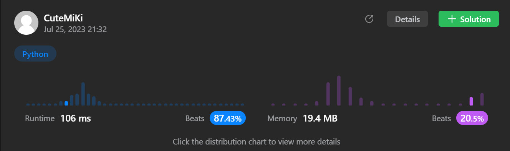

# 56. Merge Intervals
### Tag: [Medium](https://github.com/TheOnlyMiki/LeetCode-For-Fun/tree/main#medium-level), [Array](https://github.com/TheOnlyMiki/LeetCode-For-Fun/tree/main#array), [Sorting](https://github.com/TheOnlyMiki/LeetCode-For-Fun/tree/main#sorting)
---

<div class="px-5 pt-4"><div class="flex"></div><div class="_1l1MA" data-track-load="description_content"><p>Given an array&nbsp;of <code>intervals</code>&nbsp;where <code>intervals[i] = [start<sub>i</sub>, end<sub>i</sub>]</code>, merge all overlapping intervals, and return <em>an array of the non-overlapping intervals that cover all the intervals in the input</em>.</p>

<p>&nbsp;</p>
<p><strong class="example">Example 1:</strong></p>

<pre><strong>Input:</strong> intervals = [[1,3],[2,6],[8,10],[15,18]]
<strong>Output:</strong> [[1,6],[8,10],[15,18]]
<strong>Explanation:</strong> Since intervals [1,3] and [2,6] overlap, merge them into [1,6].
</pre>

<p><strong class="example">Example 2:</strong></p>

<pre><strong>Input:</strong> intervals = [[1,4],[4,5]]
<strong>Output:</strong> [[1,5]]
<strong>Explanation:</strong> Intervals [1,4] and [4,5] are considered overlapping.
</pre>

<p>&nbsp;</p>
<p><strong>Constraints:</strong></p>

<ul>
	<li><code>1 &lt;= intervals.length &lt;= 10<sup>4</sup></code></li>
	<li><code>intervals[i].length == 2</code></li>
	<li><code>0 &lt;= start<sub>i</sub> &lt;= end<sub>i</sub> &lt;= 10<sup>4</sup></code></li>
</ul>
</div></div>

---


### Solution

```python
class Solution(object):
    def merge(self, intervals):
        """
        :type intervals: List[List[int]]
        :rtype: List[List[int]]
        """
        output = []

        intervals = sorted(intervals, key=lambda x:x[0])

        record_i, record_j = intervals[0] 

        for i in range(1, len(intervals)):
            if intervals[i][0] > record_j:
                output.append([record_i, record_j])
                record_i, record_j = intervals[i]
            else:
                if intervals[i][1] > record_j:
                    record_j = intervals[i][1]

        output.append([record_i, record_j])

        return output
        """

        # Option 1
        length = len(intervals)
        output = []
        i = 0 

        intervals = sorted(intervals, key=lambda x:x[0])

        record_i = record_j = None

        while i < length:
            record_i, record_j = intervals[i]

            while i + 1 < length and intervals[i+1][0] <= record_j:
                i += 1
                if record_j < intervals[i][1]:
                    record_j = intervals[i][1]

            output.append([record_i, record_j])
            i += 1

        return output
        """
```
