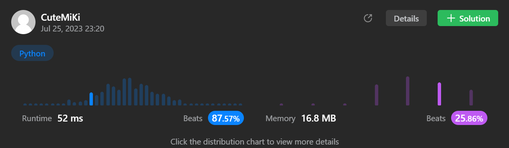

# 57. Insert Interval
### Tag: [Medium](https://github.com/TheOnlyMiki/LeetCode-For-Fun/tree/main#medium-level), [Array](https://github.com/TheOnlyMiki/LeetCode-For-Fun/tree/main#array)
---

<div class="px-5 pt-4"><div class="flex"></div><div class="_1l1MA" data-track-load="description_content"><p>You are given an array of non-overlapping intervals <code>intervals</code> where <code>intervals[i] = [start<sub>i</sub>, end<sub>i</sub>]</code> represent the start and the end of the <code>i<sup>th</sup></code> interval and <code>intervals</code> is sorted in ascending order by <code>start<sub>i</sub></code>. You are also given an interval <code>newInterval = [start, end]</code> that represents the start and end of another interval.</p>

<p>Insert <code>newInterval</code> into <code>intervals</code> such that <code>intervals</code> is still sorted in ascending order by <code>start<sub>i</sub></code> and <code>intervals</code> still does not have any overlapping intervals (merge overlapping intervals if necessary).</p>

<p>Return <code>intervals</code><em> after the insertion</em>.</p>

<p>&nbsp;</p>
<p><strong class="example">Example 1:</strong></p>

<pre><strong>Input:</strong> intervals = [[1,3],[6,9]], newInterval = [2,5]
<strong>Output:</strong> [[1,5],[6,9]]
</pre>

<p><strong class="example">Example 2:</strong></p>

<pre><strong>Input:</strong> intervals = [[1,2],[3,5],[6,7],[8,10],[12,16]], newInterval = [4,8]
<strong>Output:</strong> [[1,2],[3,10],[12,16]]
<strong>Explanation:</strong> Because the new interval [4,8] overlaps with [3,5],[6,7],[8,10].
</pre>

<p>&nbsp;</p>
<p><strong>Constraints:</strong></p>

<ul>
	<li><code>0 &lt;= intervals.length &lt;= 10<sup>4</sup></code></li>
	<li><code>intervals[i].length == 2</code></li>
	<li><code>0 &lt;= start<sub>i</sub> &lt;= end<sub>i</sub> &lt;= 10<sup>5</sup></code></li>
	<li><code>intervals</code> is sorted by <code>start<sub>i</sub></code> in <strong>ascending</strong> order.</li>
	<li><code>newInterval.length == 2</code></li>
	<li><code>0 &lt;= start &lt;= end &lt;= 10<sup>5</sup></code></li>
</ul>
</div></div>

---


### Solution

```python
class Solution(object):
    def insert(self, intervals, newInterval):
        """
        :type intervals: List[List[int]]
        :type newInterval: List[int]
        :rtype: List[List[int]]
        """
        record = -1
        for i in range(len(intervals)):
            if intervals[i][0] > newInterval[0]:
                break
            else:
                record = i

        intervals.insert(record + 1, newInterval)

        i = 0
        length = len(intervals)
        record_i = record_j = None
        output = []

        while i < length:
            record_i, record_j = intervals[i]

            while i + 1 < length and intervals[i+1][0] <= record_j:
                i += 1
                if record_j < intervals[i][1]:
                    record_j = intervals[i][1]

            output.append([record_i, record_j])
            i += 1

        return output

        # Not pass, part mistake.....
        """
        if len(intervals) == 0:
            return [newInterval]

        record = -1

        for i in range(len(intervals)):
            if intervals[i][0] <= newInterval[0]:
                record = i

        intervals.insert(record + 1, newInterval)

        if record == -1:
            record = 0

        i = record

        length = len(intervals)

        record_i, record_j = intervals[i]

        while i + 1 < length and intervals[i+1][0] <= record_j:
            i += 1
            if record_j < intervals[i][1]:
                record_j = intervals[i][1]

        newInterval = [record_i, record_j]
        print(intervals, record, i+1, newInterval)
        
        for index in range(record, i+1):
            del intervals[record] 

        print(intervals, record, i+1)

        intervals.insert(record, newInterval)
        
        return intervals
        """
```
