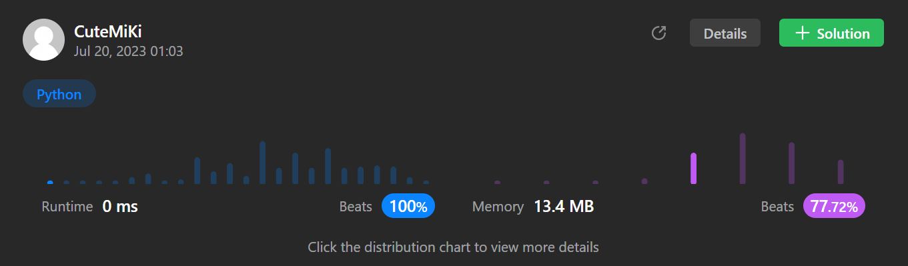

# 58. Length of Last Word
### Tag: [Easy](https://github.com/TheOnlyMiki/LeetCode-For-Fun/tree/main#easy-level), [String](https://github.com/TheOnlyMiki/LeetCode-For-Fun/tree/main#string)
---
<div class="px-5 pt-4"><div class="flex"></div><div class="_1l1MA" data-track-load="description_content"><p>Given a string <code>s</code> consisting of words and spaces, return <em>the length of the <strong>last</strong> word in the string.</em></p>

<p>A <strong>word</strong> is a maximal <span data-keyword="substring-nonempty" class=" cursor-pointer relative text-dark-blue-s text-sm"><div class="popover-wrapper inline-block" data-headlessui-state=""><div><div id="headlessui-popover-button-:rm:" aria-expanded="false" data-headlessui-state="">substring</div></div></div></span> consisting of non-space characters only.</p>

<p>&nbsp;</p>
<p><strong class="example">Example 1:</strong></p>

<pre><strong>Input:</strong> s = "Hello World"
<strong>Output:</strong> 5
<strong>Explanation:</strong> The last word is "World" with length 5.
</pre>

<p><strong class="example">Example 2:</strong></p>

<pre><strong>Input:</strong> s = "   fly me   to   the moon  "
<strong>Output:</strong> 4
<strong>Explanation:</strong> The last word is "moon" with length 4.
</pre>

<p><strong class="example">Example 3:</strong></p>

<pre><strong>Input:</strong> s = "luffy is still joyboy"
<strong>Output:</strong> 6
<strong>Explanation:</strong> The last word is "joyboy" with length 6.
</pre>

<p>&nbsp;</p>
<p><strong>Constraints:</strong></p>

<ul>
	<li><code>1 &lt;= s.length &lt;= 10<sup>4</sup></code></li>
	<li><code>s</code> consists of only English letters and spaces <code>' '</code>.</li>
	<li>There will be at least one word in <code>s</code>.</li>
</ul>
</div></div>

---


### Solution

```python
class Solution(object):
    def lengthOfLastWord(self, s):
        """
        :type s: str
        :rtype: int
        """
        #Option 2
        consum = 0

        for i in s[::-1]:
            if i != ' ':
                consum+= 1
            elif consum != 0:
                return consum

        #Option 1
        return len(s.split()[-1])
```
