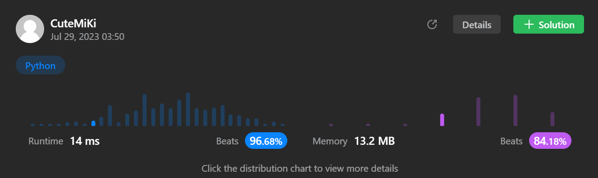

# 61. Rotate List
### Tag: [Medium](https://github.com/TheOnlyMiki/LeetCode-For-Fun/tree/main#medium-level), [Linked List](https://github.com/TheOnlyMiki/LeetCode-For-Fun/tree/main#linked-list), [Two Pointers](https://github.com/TheOnlyMiki/LeetCode-For-Fun/tree/main#two-pointers)
---
<div class="px-5 pt-4"><div class="flex"></div><div class="_1l1MA" data-track-load="description_content"><p>Given the <code>head</code> of a linked&nbsp;list, rotate the list to the right by <code>k</code> places.</p>

<p>&nbsp;</p>
<p><strong class="example">Example 1:</strong></p>

<pre><strong>Input:</strong> head = [1,2,3,4,5], k = 2
<strong>Output:</strong> [4,5,1,2,3]
</pre>

<p><strong class="example">Example 2:</strong></p>

<pre><strong>Input:</strong> head = [0,1,2], k = 4
<strong>Output:</strong> [2,0,1]
</pre>

<p>&nbsp;</p>
<p><strong>Constraints:</strong></p>

<ul>
	<li>The number of nodes in the list is in the range <code>[0, 500]</code>.</li>
	<li><code>-100 &lt;= Node.val &lt;= 100</code></li>
	<li><code>0 &lt;= k &lt;= 2 * 10<sup>9</sup></code></li>
</ul>
</div></div>

---


### Solution

```python
# Definition for singly-linked list.
# class ListNode(object):
#     def __init__(self, val=0, next=None):
#         self.val = val
#         self.next = next
class Solution(object):
    def rotateRight(self, head, k):
        """
        :type head: ListNode
        :type k: int
        :rtype: ListNode
        """
        if head == None:
            return None

        record_list = []

        record = head
        i = 0
        
        while record:
            record_list.append(record)
            record = record.next
            i += 1

        shift = k % i
        record = head

        if shift != 0:
            record_list[-1].next = head
            record_list[i - shift - 1].next = None
            return record_list[i - shift]
        else:
            return head
```
