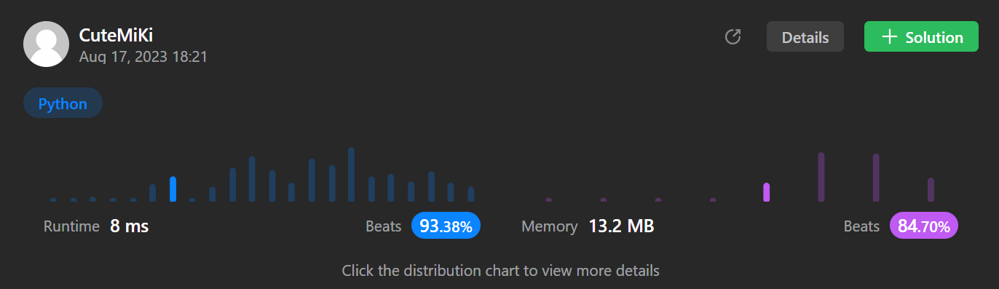

# 70. Climbing Stairs
### Tag: [Easy](https://github.com/TheOnlyMiki/LeetCode-For-Fun/tree/main#easy-level), [Math](https://github.com/TheOnlyMiki/LeetCode-For-Fun/tree/main#math), [Dynamic Programming](https://github.com/TheOnlyMiki/LeetCode-For-Fun/tree/main#dynamic-programming)
---
<div class="px-5 pt-4"><div class="flex"></div><div class="xFUwe" data-track-load="description_content"><p>You are climbing a staircase. It takes <code>n</code> steps to reach the top.</p>

<p>Each time you can either climb <code>1</code> or <code>2</code> steps. In how many distinct ways can you climb to the top?</p>

<p>&nbsp;</p>
<p><strong class="example">Example 1:</strong></p>

<pre><strong>Input:</strong> n = 2
<strong>Output:</strong> 2
<strong>Explanation:</strong> There are two ways to climb to the top.
1. 1 step + 1 step
2. 2 steps
</pre>

<p><strong class="example">Example 2:</strong></p>

<pre><strong>Input:</strong> n = 3
<strong>Output:</strong> 3
<strong>Explanation:</strong> There are three ways to climb to the top.
1. 1 step + 1 step + 1 step
2. 1 step + 2 steps
3. 2 steps + 1 step
</pre>

<p>&nbsp;</p>
<p><strong>Constraints:</strong></p>

<ul>
	<li><code>1 &lt;= n &lt;= 45</code></li>
</ul>
</div></div>

---


### Solution

```python
class Solution(object):
    def climbStairs(self, n):
        """
        :type n: int
        :rtype: int
        """
        count = {0:0, 1:1, 2:2, 3:3}

        def calculator(n):
            if n in count:
                return count[n]

            count[n] = calculator(n-1) + calculator(n-2)
            return count[n]

        return calculator(n)
```
