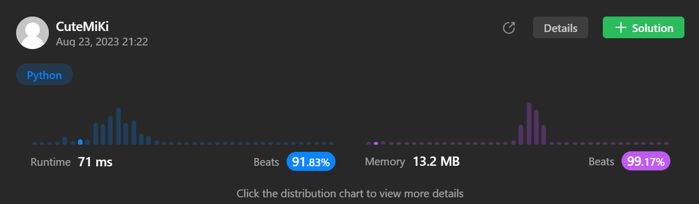

# 72. Edit Distance
### Tag: [Medium](https://github.com/TheOnlyMiki/LeetCode-For-Fun/tree/main#medium-level), [Dynamic Programming](https://github.com/TheOnlyMiki/LeetCode-For-Fun/tree/main#dynamic-programming), [String](https://github.com/TheOnlyMiki/LeetCode-For-Fun/tree/main#string)
---
<div class="px-5 pt-4"><div class="flex"></div><div class="xFUwe" data-track-load="description_content"><p>Given two strings <code>word1</code> and <code>word2</code>, return <em>the minimum number of operations required to convert <code>word1</code> to <code>word2</code></em>.</p>

<p>You have the following three operations permitted on a word:</p>

<ul>
	<li>Insert a character</li>
	<li>Delete a character</li>
	<li>Replace a character</li>
</ul>

<p>&nbsp;</p>
<p><strong class="example">Example 1:</strong></p>

<pre><strong>Input:</strong> word1 = "horse", word2 = "ros"
<strong>Output:</strong> 3
<strong>Explanation:</strong> 
horse -&gt; rorse (replace 'h' with 'r')
rorse -&gt; rose (remove 'r')
rose -&gt; ros (remove 'e')
</pre>

<p><strong class="example">Example 2:</strong></p>

<pre><strong>Input:</strong> word1 = "intention", word2 = "execution"
<strong>Output:</strong> 5
<strong>Explanation:</strong> 
intention -&gt; inention (remove 't')
inention -&gt; enention (replace 'i' with 'e')
enention -&gt; exention (replace 'n' with 'x')
exention -&gt; exection (replace 'n' with 'c')
exection -&gt; execution (insert 'u')
</pre>

<p>&nbsp;</p>
<p><strong>Constraints:</strong></p>

<ul>
	<li><code>0 &lt;= word1.length, word2.length &lt;= 500</code></li>
	<li><code>word1</code> and <code>word2</code> consist of lowercase English letters.</li>
</ul>
</div></div>

---


### Solution

```python
class Solution(object):
    def minDistance(self, word1, word2):
        """
        :type word1: str
        :type word2: str
        :rtype: int
        """
        # Option 2 - Dynamic Program, Space O(n)
        length2 = len(word2)+1
        record1 = range(length2)
        record2 = None

        word2_iteration = range(1, length2)

        for i in range(1, len(word1)+1):
            record2 = range(length2)
            record2[0] = record1[0] + 1
            for j in word2_iteration:
                record2[j] = record1[j-1] if word1[i-1] == word2[j-1] else min(record1[j-1], record1[j], record2[j-1]) + 1

            record1 = record2

        return record1[-1]

        # Option 1 - Dynamic Program, Space O(m*n)
        """
        length2 = len(word2)+1
        record = [ range(length2) for _ in word1]
        record.append(range(length2))
        word1_iteration = range(1, len(record))
        word2_iteration = range(1, length2)

        for i in word1_iteration:
            record[i][0] = record[i-1][0] + 1

        previou_i = None
        for i in word1_iteration:
            previou_i = i-1
            for j in word2_iteration:
                record[i][j] = record[previou_i][j-1] if word1[i-1] == word2[j-1] else min(record[previou_i][j-1], record[previou_i][j], record[i][j-1]) + 1
            
        return record[-1][-1]
        """
```
