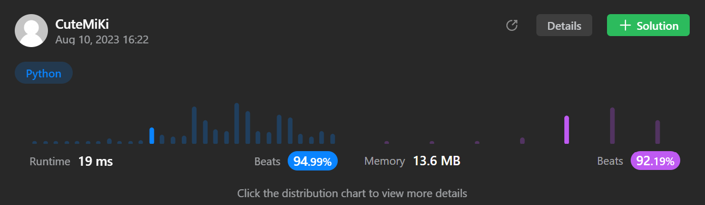

# 74. Search a 2D Matrix
### Tag: [Medium](https://github.com/TheOnlyMiki/LeetCode-For-Fun/tree/main#medium-level), [Array](https://github.com/TheOnlyMiki/LeetCode-For-Fun/tree/main#array), [Binary Search](https://github.com/TheOnlyMiki/LeetCode-For-Fun/tree/main#binary-search), [Matrix](https://github.com/TheOnlyMiki/LeetCode-For-Fun/tree/main#matrix)
---
<div class="px-5 pt-4"><div class="flex"></div><div class="xFUwe" data-track-load="description_content"><p>You are given an <code>m x n</code> integer matrix <code>matrix</code> with the following two properties:</p>

<ul>
	<li>Each row is sorted in non-decreasing order.</li>
	<li>The first integer of each row is greater than the last integer of the previous row.</li>
</ul>

<p>Given an integer <code>target</code>, return <code>true</code> <em>if</em> <code>target</code> <em>is in</em> <code>matrix</code> <em>or</em> <code>false</code> <em>otherwise</em>.</p>

<p>You must write a solution in <code>O(log(m * n))</code> time complexity.</p>

<p>&nbsp;</p>
<p><strong class="example">Example 1:</strong></p>

<pre><strong>Input:</strong> matrix = [[1,3,5,7],[10,11,16,20],[23,30,34,60]], target = 3
<strong>Output:</strong> true
</pre>

<p><strong class="example">Example 2:</strong></p>

<pre><strong>Input:</strong> matrix = [[1,3,5,7],[10,11,16,20],[23,30,34,60]], target = 13
<strong>Output:</strong> false
</pre>

<p>&nbsp;</p>
<p><strong>Constraints:</strong></p>

<ul>
	<li><code>m == matrix.length</code></li>
	<li><code>n == matrix[i].length</code></li>
	<li><code>1 &lt;= m, n &lt;= 100</code></li>
	<li><code>-10<sup>4</sup> &lt;= matrix[i][j], target &lt;= 10<sup>4</sup></code></li>
</ul>
</div></div>

---


### Solution

```python
class Solution(object):
    def searchMatrix(self, matrix, target):
        """
        :type matrix: List[List[int]]
        :type target: int
        :rtype: bool
        """
        # Option 2 - Binary Search, or call devide and conquer
        m, n = len(matrix), len(matrix[0])
        left, right = 0, m*n-1
        mid = temp = None

        while left <= right:
            mid = (left + right) // 2
            temp = matrix[mid//n][mid%n]
            if temp > target:
                right = mid - 1
            elif temp < target:
                left = mid + 1
            else:
                return True
        
        return False

        # Option 1 - Linear Method
        """
        end_pos = len(matrix[0]) - 1

        for i in xrange(len(matrix)):
            if target <= matrix[i][end_pos]:
                try:
                    matrix[i].index(target)
                    return True
                except:
                    return False

        return False
        """
```
