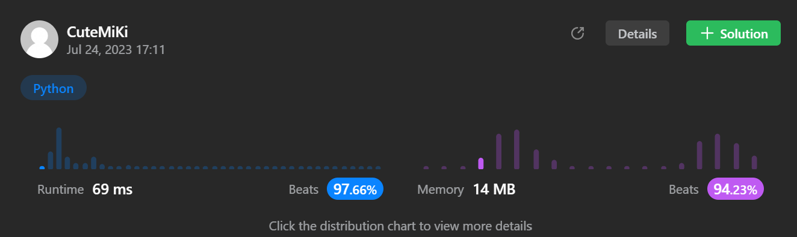

# 76. Minimum Window Substring
### Tag: [Hard](https://github.com/TheOnlyMiki/LeetCode-For-Fun/tree/main#hard-level), [Hash Table](https://github.com/TheOnlyMiki/LeetCode-For-Fun/tree/main#hash-table), [String](https://github.com/TheOnlyMiki/LeetCode-For-Fun/tree/main#string), [Sliding Window](https://github.com/TheOnlyMiki/LeetCode-For-Fun/tree/main#sliding-window)
---
<div class="px-5 pt-4"><div class="flex"></div><div class="_1l1MA" data-track-load="description_content"><p>Given two strings <code>s</code> and <code>t</code> of lengths <code>m</code> and <code>n</code> respectively, return <em>the <strong>minimum window</strong></em> <span data-keyword="substring-nonempty" class=" cursor-pointer relative text-dark-blue-s text-sm"><div class="popover-wrapper inline-block" data-headlessui-state=""><div><div id="headlessui-popover-button-:r1e:" aria-expanded="false" data-headlessui-state=""><strong><em>substring</em></strong></div></div></div></span><em> of </em><code>s</code><em> such that every character in </em><code>t</code><em> (<strong>including duplicates</strong>) is included in the window</em>. If there is no such substring, return <em>the empty string </em><code>""</code>.</p>

<p>The testcases will be generated such that the answer is <strong>unique</strong>.</p>

<p>&nbsp;</p>
<p><strong class="example">Example 1:</strong></p>

<pre><strong>Input:</strong> s = "ADOBECODEBANC", t = "ABC"
<strong>Output:</strong> "BANC"
<strong>Explanation:</strong> The minimum window substring "BANC" includes 'A', 'B', and 'C' from string t.
</pre>

<p><strong class="example">Example 2:</strong></p>

<pre><strong>Input:</strong> s = "a", t = "a"
<strong>Output:</strong> "a"
<strong>Explanation:</strong> The entire string s is the minimum window.
</pre>

<p><strong class="example">Example 3:</strong></p>

<pre><strong>Input:</strong> s = "a", t = "aa"
<strong>Output:</strong> ""
<strong>Explanation:</strong> Both 'a's from t must be included in the window.
Since the largest window of s only has one 'a', return empty string.
</pre>

<p>&nbsp;</p>
<p><strong>Constraints:</strong></p>

<ul>
	<li><code>m == s.length</code></li>
	<li><code>n == t.length</code></li>
	<li><code>1 &lt;= m, n &lt;= 10<sup>5</sup></code></li>
	<li><code>s</code> and <code>t</code> consist of uppercase and lowercase English letters.</li>
</ul>

<p>&nbsp;</p>
<p><strong>Follow up:</strong> Could you find an algorithm that runs in <code>O(m + n)</code> time?</p>
</div></div>

---


### Solution

```python
class Solution(object):
    def minWindow(self, s, t):
        """
        :type s: str
        :type t: str
        :rtype: str
        """
        # Option 2
        t_len = len(t)
        s_len = len(s)
        
        count = {}
        # Counting the characters in t
        for c in t:
            if c in count:
                count[c] += 1
            else:
                count[c] = 1
        
        i, i_2 = 0, 0
        window_size = s_len + 1
        record_i = 0

        while i_2 < s_len:
            c = s[i_2]
            # Check the char is in t, if in t, we can reduce the number of needs
            if c in count:
                if count[c] > 0:
                    t_len -= 1
                count[c] -= 1

            # If the number of needs to match were 0, means t is find in s
            while t_len == 0:
                # Update window_size when record size is grather then new size
                if window_size > i_2 - i + 1:
                    window_size = i_2 - i + 1
                    record_i = i

                c_2 = s[i]
                # Move i pointer forward, to reduce the window size
                if c_2 in count:
                    if count[c_2] == 0:
                        t_len += 1
                    count[c_2] += 1

                # Initical next iteration
                i += 1

            # Initical next iteration
            i_2 += 1

        if window_size > s_len:
            return ""

        return s[record_i : record_i + window_size]

        # Option 1 - Run time too over, can't pass
        """
        t_len = len(t)
        s_len = len(s)

        i = 0
        window_size = s_len + 1
        record_index = [0, 0]

        while i < s_len:
            if s[i] in t:
                temp = s[i:i+window_size]
                record = []
                try:
                    for c in t:
                        record.append(temp.index(c))
                        temp = temp.replace(c, ' ', 1)
                except:
                    i += 1
                    continue
                
                record = sorted(record)
                new_window_size = record[-1] - record[0] + 1
                if new_window_size < window_size:
                    if new_window_size == t_len:
                        return s[record[0] + i : record[-1] + i + 1]
                    window_size = new_window_size
                    record_index[0] = record[0] + i
                    record_index[1] = record[-1] + i + 1
            
            i += 1

        if window_size > s_len:
            return ""

        return s[record_index[0]:record_index[1]]
        """
```
