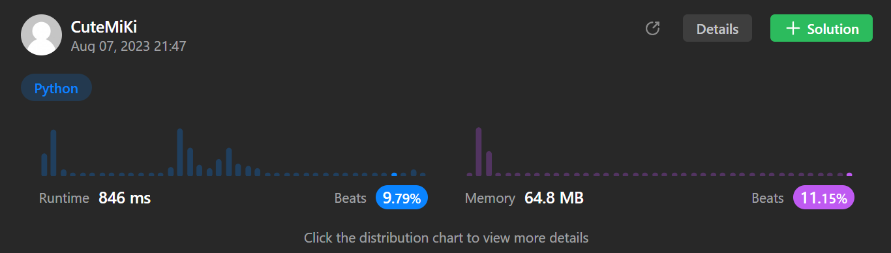

# 77. Combinations
### Tag: [Medium](https://github.com/TheOnlyMiki/LeetCode-For-Fun/tree/main#medium-level), [Backtracking](https://github.com/TheOnlyMiki/LeetCode-For-Fun/tree/main#backtracking)
---
<div class="px-5 pt-4"><div class="flex"></div><div class="xFUwe" data-track-load="description_content"><p>Given two integers <code>n</code> and <code>k</code>, return <em>all possible combinations of</em> <code>k</code> <em>numbers chosen from the range</em> <code>[1, n]</code>.</p>

<p>You may return the answer in <strong>any order</strong>.</p>

<p>&nbsp;</p>
<p><strong class="example">Example 1:</strong></p>

<pre><strong>Input:</strong> n = 4, k = 2
<strong>Output:</strong> [[1,2],[1,3],[1,4],[2,3],[2,4],[3,4]]
<strong>Explanation:</strong> There are 4 choose 2 = 6 total combinations.
Note that combinations are unordered, i.e., [1,2] and [2,1] are considered to be the same combination.
</pre>

<p><strong class="example">Example 2:</strong></p>

<pre><strong>Input:</strong> n = 1, k = 1
<strong>Output:</strong> [[1]]
<strong>Explanation:</strong> There is 1 choose 1 = 1 total combination.
</pre>

<p>&nbsp;</p>
<p><strong>Constraints:</strong></p>

<ul>
	<li><code>1 &lt;= n &lt;= 20</code></li>
	<li><code>1 &lt;= k &lt;= n</code></li>
</ul>
</div></div>

---


### Solution

```python
class Solution(object):
    def combine(self, n, k):
        """
        :type n: int
        :type k: int
        :rtype: List[List[int]]
        """
        output = []
        def getNext(start, record):
            if len(record) == k:
                output.append(record[:])
                return

            for num in range(start, n+1):
                record.append(num)
                getNext(num+1, record)
                record.pop()

        getNext(1, [])
        return output
```
