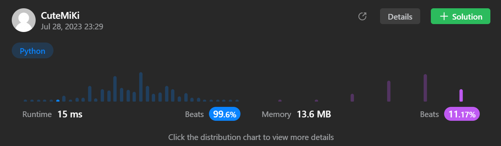

# 82. Remove Duplicates from Sorted List II
### Tag: [Medium](https://github.com/TheOnlyMiki/LeetCode-For-Fun/tree/main#medium-level), [Linked List](https://github.com/TheOnlyMiki/LeetCode-For-Fun/tree/main#linked-list), [Two Pointers](https://github.com/TheOnlyMiki/LeetCode-For-Fun/tree/main#two-pointers)
---
<div class="px-5 pt-4"><div class="flex"></div><div class="_1l1MA" data-track-load="description_content"><p>Given the <code>head</code> of a sorted linked list, <em>delete all nodes that have duplicate numbers, leaving only distinct numbers from the original list</em>. Return <em>the linked list <strong>sorted</strong> as well</em>.</p>

<p>&nbsp;</p>
<p><strong class="example">Example 1:</strong></p>

<pre><strong>Input:</strong> head = [1,2,3,3,4,4,5]
<strong>Output:</strong> [1,2,5]
</pre>

<p><strong class="example">Example 2:</strong></p>

<pre><strong>Input:</strong> head = [1,1,1,2,3]
<strong>Output:</strong> [2,3]
</pre>

<p>&nbsp;</p>
<p><strong>Constraints:</strong></p>

<ul>
	<li>The number of nodes in the list is in the range <code>[0, 300]</code>.</li>
	<li><code>-100 &lt;= Node.val &lt;= 100</code></li>
	<li>The list is guaranteed to be <strong>sorted</strong> in ascending order.</li>
</ul>
</div></div>

---


### Solution

```python
# Definition for singly-linked list.
# class ListNode(object):
#     def __init__(self, val=0, next=None):
#         self.val = val
#         self.next = next
class Solution(object):
    def deleteDuplicates(self, head):
        """
        :type head: ListNode
        :rtype: ListNode
        """

        if head == None:
            return None

        previous = ListNode()
        result_head = previous
        check_node = head
        record = head.next
        last_node_check = True

        while record:
            if record.val != check_node.val:
                previous.next = check_node
                previous = previous.next
                previous.next = None
                check_node = record
            else:
                while record.next and record.next.val == check_node.val:
                    record = record.next

                if record.next == None:
                    last_node_check = False
                    break

                record = record.next
                check_node = record
            
            record = record.next

        if last_node_check:
            previous.next = check_node

        return result_head.next
```
