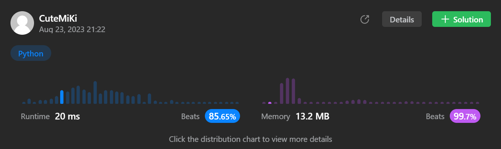

# 97. Interleaving String
### Tag: [Medium](https://github.com/TheOnlyMiki/LeetCode-For-Fun/tree/main#medium-level), [Dynamic Programming](https://github.com/TheOnlyMiki/LeetCode-For-Fun/tree/main#dynamic-programming), [String](https://github.com/TheOnlyMiki/LeetCode-For-Fun/tree/main#string)
---
<div class="px-5 pt-4"><div class="flex"></div><div class="xFUwe" data-track-load="description_content"><p>Given strings <code>s1</code>, <code>s2</code>, and <code>s3</code>, find whether <code>s3</code> is formed by an <strong>interleaving</strong> of <code>s1</code> and <code>s2</code>.</p>

<p>An <strong>interleaving</strong> of two strings <code>s</code> and <code>t</code> is a configuration where <code>s</code> and <code>t</code> are divided into <code>n</code> and <code>m</code> <span data-keyword="substring-nonempty" datakeyword="substring-nonempty" class=" cursor-pointer relative text-dark-blue-s text-sm"><div class="popover-wrapper inline-block" data-headlessui-state=""><div><div id="headlessui-popover-button-:r16:" aria-expanded="false" data-headlessui-state=""><div>substrings</div></div><div style="position: fixed; z-index: 9999; inset: 0px auto auto 0px; transform: translate(321px, 300px);"></div></div></div></span> respectively, such that:</p>

<ul>
	<li><code>s = s<sub>1</sub> + s<sub>2</sub> + ... + s<sub>n</sub></code></li>
	<li><code>t = t<sub>1</sub> + t<sub>2</sub> + ... + t<sub>m</sub></code></li>
	<li><code>|n - m| &lt;= 1</code></li>
	<li>The <strong>interleaving</strong> is <code>s<sub>1</sub> + t<sub>1</sub> + s<sub>2</sub> + t<sub>2</sub> + s<sub>3</sub> + t<sub>3</sub> + ...</code> or <code>t<sub>1</sub> + s<sub>1</sub> + t<sub>2</sub> + s<sub>2</sub> + t<sub>3</sub> + s<sub>3</sub> + ...</code></li>
</ul>

<p><strong>Note:</strong> <code>a + b</code> is the concatenation of strings <code>a</code> and <code>b</code>.</p>

<p>&nbsp;</p>
<p><strong class="example">Example 1:</strong></p>

<pre><strong>Input:</strong> s1 = "aabcc", s2 = "dbbca", s3 = "aadbbcbcac"
<strong>Output:</strong> true
<strong>Explanation:</strong> One way to obtain s3 is:
Split s1 into s1 = "aa" + "bc" + "c", and s2 into s2 = "dbbc" + "a".
Interleaving the two splits, we get "aa" + "dbbc" + "bc" + "a" + "c" = "aadbbcbcac".
Since s3 can be obtained by interleaving s1 and s2, we return true.
</pre>

<p><strong class="example">Example 2:</strong></p>

<pre><strong>Input:</strong> s1 = "aabcc", s2 = "dbbca", s3 = "aadbbbaccc"
<strong>Output:</strong> false
<strong>Explanation:</strong> Notice how it is impossible to interleave s2 with any other string to obtain s3.
</pre>

<p><strong class="example">Example 3:</strong></p>

<pre><strong>Input:</strong> s1 = "", s2 = "", s3 = ""
<strong>Output:</strong> true
</pre>

<p>&nbsp;</p>
<p><strong>Constraints:</strong></p>

<ul>
	<li><code>0 &lt;= s1.length, s2.length &lt;= 100</code></li>
	<li><code>0 &lt;= s3.length &lt;= 200</code></li>
	<li><code>s1</code>, <code>s2</code>, and <code>s3</code> consist of lowercase English letters.</li>
</ul>

<p>&nbsp;</p>
<p><strong>Follow up:</strong> Could you solve it using only <code>O(s2.length)</code> additional memory space?</p>
</div></div>

---


### Solution

```python
class Solution(object):
    def isInterleave(self, s1, s2, s3):
        """
        :type s1: str
        :type s2: str
        :type s3: str
        :rtype: bool
        """
        # Option 3 - Dynamic Program, Space O(m)
        if len(s1) + len(s2) != len(s3):
            return False

        length2 = len(s2) + 1
        record1 = [False] * length2
        record1[0] = True
        record2 = None
        s1_iteration = range(1, len(s1)+1)
        s2_iteration = range(1, length2)

        for i in s2_iteration:
            record1[i] = record1[i-1] and s2[i-1] == s3[i-1]

        for i in s1_iteration:
            record2 = [False] * length2
            record2[0] = record1[0] and s1[i-1] == s3[i-1]
            for j in s2_iteration:
                record2[j] = (
                    (record1[j] if s1[i-1] == s3[i+j-1] else False) or
                    (record2[j-1] if s2[j-1] == s3[i+j-1] else False)
                )
            
            record1 = record2
        
        return record1[-1]

        # Option 2 - Dynamic Program, Space O(m*n)
        """
        length1, length2 = len(s1), len(s2) + 1
        if length1 + length2 - 1 != len(s3):
            return False

        record = [ [False] * length2 for _ in s1 ]
        record.append([False] * length2)
        record[0][0] = True
        s1_iteration = range(1, length1+1)
        s2_iteration = range(1, length2)

        for i in s1_iteration:
            record[i][0] = record[i-1][0] and s1[i-1] == s3[i-1]

        for i in s2_iteration:
            record[0][i] = record[0][i-1] and s2[i-1] == s3[i-1]

        for i in s1_iteration:
            for j in s2_iteration:
                record[i][j] = (
                    (record[i-1][j] if s1[i-1] == s3[i+j-1] else False) or
                    (record[i][j-1] if s2[j-1] == s3[i+j-1] else False)
                )

        return record[-1][-1]
        """

        # Option 1 - Recursion, cannot pass, over time limit
        """
        length1, length2 = len(s1), len(s2)
        if length1 + length2 != len(s3):
            return False

        def DFS(x1, x2):
            if x1 == length1 and x2 == length2:
                return True

            return (
                (DFS(x1 + 1, x2) if x1 < length1 and s1[x1] == s3[x1+x2] else False) or 
                (DFS(x1, x2 + 1) if x2 < length2 and s2[x2] == s3[x1+x2] else False)
            )

        return DFS(0, 0)
        """
```
