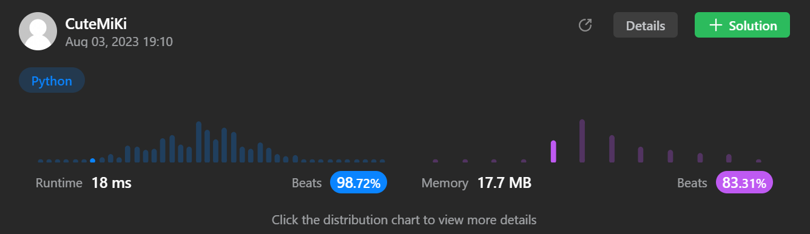

# 98. Validate Binary Search Tree
### Tag: [Medium](https://github.com/TheOnlyMiki/LeetCode-For-Fun/tree/main#medium-level), [Depth-First Search](https://github.com/TheOnlyMiki/LeetCode-For-Fun/tree/main#depth-first-search), [Binary Tree](https://github.com/TheOnlyMiki/LeetCode-For-Fun/tree/main#binary-tree)
---
<div class="px-5 pt-4"><div class="flex"></div><div class="xFUwe" data-track-load="description_content"><p>Given the <code>root</code> of a binary tree, <em>determine if it is a valid binary search tree (BST)</em>.</p>

<p>A <strong>valid BST</strong> is defined as follows:</p>

<ul>
	<li>The left <span data-keyword="subtree" class=" cursor-pointer relative text-dark-blue-s text-sm"><div class="popover-wrapper inline-block" data-headlessui-state=""><div><div id="headlessui-popover-button-:ru:" aria-expanded="false" data-headlessui-state="">subtree</div></div></div></span> of a node contains only nodes with keys <strong>less than</strong> the node's key.</li>
	<li>The right subtree of a node contains only nodes with keys <strong>greater than</strong> the node's key.</li>
	<li>Both the left and right subtrees must also be binary search trees.</li>
</ul>

<p>&nbsp;</p>
<p><strong class="example">Example 1:</strong></p>

<pre><strong>Input:</strong> root = [2,1,3]
<strong>Output:</strong> true
</pre>

<p><strong class="example">Example 2:</strong></p>

<pre><strong>Input:</strong> root = [5,1,4,null,null,3,6]
<strong>Output:</strong> false
<strong>Explanation:</strong> The root node's value is 5 but its right child's value is 4.
</pre>

<p>&nbsp;</p>
<p><strong>Constraints:</strong></p>

<ul>
	<li>The number of nodes in the tree is in the range <code>[1, 10<sup>4</sup>]</code>.</li>
	<li><code>-2<sup>31</sup> &lt;= Node.val &lt;= 2<sup>31</sup> - 1</code></li>
</ul>
</div></div>

---


### Solution

```python
# Definition for a binary tree node.
# class TreeNode(object):
#     def __init__(self, val=0, left=None, right=None):
#         self.val = val
#         self.left = left
#         self.right = right
class Solution(object):
    def isValidBST(self, root):
        """
        :type root: TreeNode
        :rtype: bool
        """
        # Option 3
        self.maxValue = 2**31
        self.minValue = -(self.maxValue+1)

        def checkBST(root, minValue, maxValue):
            if not root:
                return True
            if not minValue < root.val < maxValue:
                return False
            return checkBST(root.left, minValue, root.val) and checkBST(root.right, root.val, maxValue)

        return checkBST(root, self.minValue, self.maxValue)

        # Option 2 - Slow
        """
        self.maxValue = 2**31
        self.minValue = -self.maxValue

        def findMaxValue(root):
            if not root:
                return self.minValue
            
            value = max(findMaxValue(root.left), findMaxValue(root.right))
            return max(value, root.val)

        def findMinValue(root):
            if not root:
                return self.maxValue

            value = min(findMinValue(root.left), findMinValue(root.right))
            return min(value, root.val)

        def checkValid(root):
            if not root:
                return True

            if root.left and findMaxValue(root.left) >= root.val:
                return False
            if root.right and findMinValue(root.right) <= root.val:
                return False
            if not checkValid(root.left) or not checkValid(root.right):
                return False

            return True

        return checkValid(root)
        """

        # Option 1 - Too Slow
        # Build a BST, then compare it was the same as original tree
        """
        # fromLeft if True means from left node of parent
        def BST(value, root, parent, fromLeft=True):
            if not root:
                if fromLeft:
                    parent.left = TreeNode(value)
                else:
                    parent.right = TreeNode(value)
                return None

            if value < root.val:
                BST(value, root.left, root, True)
            elif value > root.val:
                BST(value, root.right, root, False)
        
        nodes = [root]
        next_level = None
        temp_root = TreeNode(root.val)

        while nodes:
            next_level = []
            for node in nodes:
                if node.left:
                    next_level.append(node.left)
                    BST(node.left.val, temp_root, temp_root)
                if node.right:
                    next_level.append(node.right)
                    BST(node.right.val, temp_root, temp_root)
            nodes = next_level
        
        return str(root) == str(temp_root)
        """

        # Print Tree
        """
        nodes2 = [temp_root]
        l = l2 = []
        output = [[temp_root.val]]
        while nodes2:
            l = []
            l2 = []
            for node in nodes2:
                if node.left:
                    l.append(node.left)
                    l2.append(node.left.val)
                if node.right:
                    l.append(node.right)
                    l2.append(node.right.val)
            nodes2 = l
            if l2:
                output.append(l2)
        print(output)
        """
```
