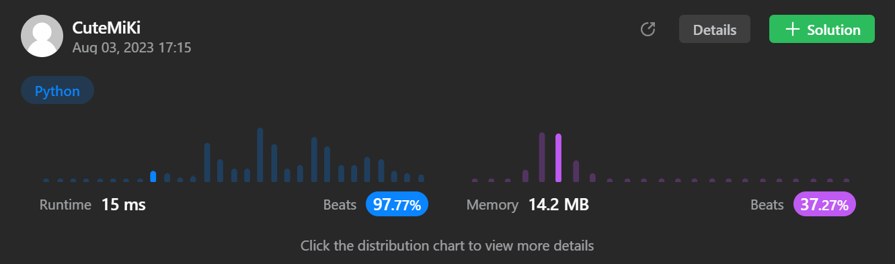

# 102. Binary Tree Level Order Traversal
### Tag: [Medium](https://github.com/TheOnlyMiki/LeetCode-For-Fun/tree/main#medium-level), [Breadth-First Search](https://github.com/TheOnlyMiki/LeetCode-For-Fun/tree/main#breadth-first-search), [Binary Tree](https://github.com/TheOnlyMiki/LeetCode-For-Fun/tree/main#binary-tree)
---

<div class="px-5 pt-4"><div class="flex"></div><div class="_1l1MA" data-track-load="description_content"><p>Given the <code>root</code> of a binary tree, return <em>the level order traversal of its nodes' values</em>. (i.e., from left to right, level by level).</p>

<p>&nbsp;</p>
<p><strong class="example">Example 1:</strong></p>

<pre><strong>Input:</strong> root = [3,9,20,null,null,15,7]
<strong>Output:</strong> [[3],[9,20],[15,7]]
</pre>

<p><strong class="example">Example 2:</strong></p>

<pre><strong>Input:</strong> root = [1]
<strong>Output:</strong> [[1]]
</pre>

<p><strong class="example">Example 3:</strong></p>

<pre><strong>Input:</strong> root = []
<strong>Output:</strong> []
</pre>

<p>&nbsp;</p>
<p><strong>Constraints:</strong></p>

<ul>
	<li>The number of nodes in the tree is in the range <code>[0, 2000]</code>.</li>
	<li><code>-1000 &lt;= Node.val &lt;= 1000</code></li>
</ul>
</div></div>

---


### Solution

```python
# Definition for a binary tree node.
# class TreeNode(object):
#     def __init__(self, val=0, left=None, right=None):
#         self.val = val
#         self.left = left
#         self.right = right
class Solution(object):
    def levelOrder(self, root):
        """
        :type root: TreeNode
        :rtype: List[List[int]]
        """
        if not root:
            return []

        output = [[root.val]]
        nodes = [root]
        next_level = store = None

        while nodes:
            next_level = []
            store = []
            for node in nodes:
                if node.left:
                    next_level.append(node.left)
                    store.append(node.left.val)
                if node.right:
                    next_level.append(node.right)
                    store.append(node.right.val)
            nodes = next_level
            if store:
                output.append(store)

        return output
```
