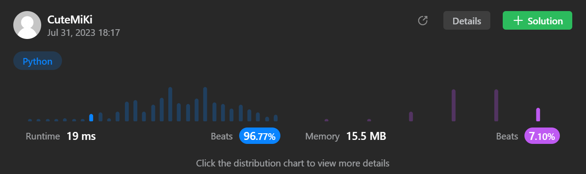

# 112. Path Sum
### Tag: [Easy](https://github.com/TheOnlyMiki/LeetCode-For-Fun/tree/main#easy-level), [Depth-First Search](https://github.com/TheOnlyMiki/LeetCode-For-Fun/tree/main#depth-first-search), [Breadth-First Search](https://github.com/TheOnlyMiki/LeetCode-For-Fun/tree/main#breadth-first-search), [Binary Tree](https://github.com/TheOnlyMiki/LeetCode-For-Fun/tree/main#binary-tree)
---
<div class="px-5 pt-4"><div class="flex"></div><div class="_1l1MA" data-track-load="description_content"><p>Given the <code>root</code> of a binary tree and an integer <code>targetSum</code>, return <code>true</code> if the tree has a <strong>root-to-leaf</strong> path such that adding up all the values along the path equals <code>targetSum</code>.</p>

<p>A <strong>leaf</strong> is a node with no children.</p>

<p>&nbsp;</p>
<p><strong class="example">Example 1:</strong></p>

<pre><strong>Input:</strong> root = [5,4,8,11,null,13,4,7,2,null,null,null,1], targetSum = 22
<strong>Output:</strong> true
<strong>Explanation:</strong> The root-to-leaf path with the target sum is shown.
</pre>

<p><strong class="example">Example 2:</strong></p>

<pre><strong>Input:</strong> root = [1,2,3], targetSum = 5
<strong>Output:</strong> false
<strong>Explanation:</strong> There two root-to-leaf paths in the tree:
(1 --&gt; 2): The sum is 3.
(1 --&gt; 3): The sum is 4.
There is no root-to-leaf path with sum = 5.
</pre>

<p><strong class="example">Example 3:</strong></p>

<pre><strong>Input:</strong> root = [], targetSum = 0
<strong>Output:</strong> false
<strong>Explanation:</strong> Since the tree is empty, there are no root-to-leaf paths.
</pre>

<p>&nbsp;</p>
<p><strong>Constraints:</strong></p>

<ul>
	<li>The number of nodes in the tree is in the range <code>[0, 5000]</code>.</li>
	<li><code>-1000 &lt;= Node.val &lt;= 1000</code></li>
	<li><code>-1000 &lt;= targetSum &lt;= 1000</code></li>
</ul>
</div></div>

---


### Solution

```python
# Definition for a binary tree node.
# class TreeNode(object):
#     def __init__(self, val=0, left=None, right=None):
#         self.val = val
#         self.left = left
#         self.right = right
class Solution(object):
    def hasPathSum(self, root, targetSum):
        """
        :type root: TreeNode
        :type targetSum: int
        :rtype: bool
        """
        if not root:
            return False

        def findSum(root, consum):
            next_consum = consum + root.val
            if root.left and root.right:
                #print("left and right:", consum + root.val)
                return findSum(root.left, next_consum) or findSum(root.right, next_consum)
            elif root.left:
                #print("left:", consum + root.val)
                return findSum(root.left, next_consum)
            elif root.right:
                #print("right:", consum + root.val)
                return findSum(root.right, next_consum)
            else:
                #print("else:", consum + root.val)
                return next_consum == targetSum

        return findSum(root, 0)
```
