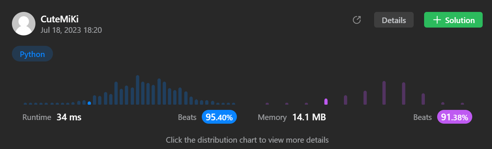

# 122. Best Time to Buy and Sell Stock II
### Tag: [Medium](https://github.com/TheOnlyMiki/LeetCode-For-Fun/tree/main#medium-level), [Array](https://github.com/TheOnlyMiki/LeetCode-For-Fun/tree/main#array), [Dynamic Programming](https://github.com/TheOnlyMiki/LeetCode-For-Fun/tree/main#dynamic-programming), [Greedy](https://github.com/TheOnlyMiki/LeetCode-For-Fun/tree/main#greedy)
---
<div class="px-5 pt-4"><div class="flex"></div><div class="_1l1MA" data-track-load="description_content"><p>You are given an integer array <code>prices</code> where <code>prices[i]</code> is the price of a given stock on the <code>i<sup>th</sup></code> day.</p>

<p>On each day, you may decide to buy and/or sell the stock. You can only hold <strong>at most one</strong> share of the stock at any time. However, you can buy it then immediately sell it on the <strong>same day</strong>.</p>

<p>Find and return <em>the <strong>maximum</strong> profit you can achieve</em>.</p>

<p>&nbsp;</p>
<p><strong class="example">Example 1:</strong></p>

<pre><strong>Input:</strong> prices = [7,1,5,3,6,4]
<strong>Output:</strong> 7
<strong>Explanation:</strong> Buy on day 2 (price = 1) and sell on day 3 (price = 5), profit = 5-1 = 4.
Then buy on day 4 (price = 3) and sell on day 5 (price = 6), profit = 6-3 = 3.
Total profit is 4 + 3 = 7.
</pre>

<p><strong class="example">Example 2:</strong></p>

<pre><strong>Input:</strong> prices = [1,2,3,4,5]
<strong>Output:</strong> 4
<strong>Explanation:</strong> Buy on day 1 (price = 1) and sell on day 5 (price = 5), profit = 5-1 = 4.
Total profit is 4.
</pre>

<p><strong class="example">Example 3:</strong></p>

<pre><strong>Input:</strong> prices = [7,6,4,3,1]
<strong>Output:</strong> 0
<strong>Explanation:</strong> There is no way to make a positive profit, so we never buy the stock to achieve the maximum profit of 0.
</pre>

<p>&nbsp;</p>
<p><strong>Constraints:</strong></p>

<ul>
	<li><code>1 &lt;= prices.length &lt;= 3 * 10<sup>4</sup></code></li>
	<li><code>0 &lt;= prices[i] &lt;= 10<sup>4</sup></code></li>
</ul>
</div></div>

---


### Solution

```python
class Solution(object):
    def maxProfit(self, prices):
        """
        :type prices: List[int]
        :rtype: int
        """

        profit = 0
        pre_low = prices[0]
        for price in prices:
            if pre_low < price:
                profit += price - pre_low
            pre_low = price

        return profit

        """
        #First, I thought the question says you can only hold 1 stock and only can trade 
        #up to two times, and only if you sold the stock you have been held, then you can 
        #purchased the new stock :(

        total_profit = 0
        profit = 0
        pre_low = prices[0]
        for i in range(len(prices)):
            price = prices[i]

            if pre_low > price:
                pre_low = price
                continue

            current_profit = price - pre_low
            
            if profit < current_profit:
                profit = current_profit

                #Calculate the remainer maximum profit
                profit_2 = 0
                pre_low_2 = price
                for price_2 in prices[i+1:]:
                    if pre_low_2 > price_2:
                        pre_low_2 = price_2
                        continue

                    current_profit_2 = price_2 - pre_low_2
                    
                    if profit_2 < current_profit_2:
                        profit_2 = current_profit_2
                
                current_total_profit = profit + profit_2
                if total_profit < current_total_profit:
                    total_profit = current_total_profit

        return total_profit
        """
```
