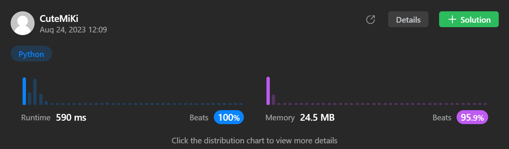

# 123. Best Time to Buy and Sell Stock III
### Tag: [Hard](https://github.com/TheOnlyMiki/LeetCode-For-Fun/tree/main#hard-level), [Array](https://github.com/TheOnlyMiki/LeetCode-For-Fun/tree/main#array), [Dynamic Programming](https://github.com/TheOnlyMiki/LeetCode-For-Fun/tree/main#dynamic-programming)
---
<div class="px-5 pt-4"><div class="flex"></div><div class="xFUwe" data-track-load="description_content"><p>You are given an array <code>prices</code> where <code>prices[i]</code> is the price of a given stock on the <code>i<sup>th</sup></code> day.</p>

<p>Find the maximum profit you can achieve. You may complete <strong>at most two transactions</strong>.</p>

<p><strong>Note:</strong> You may not engage in multiple transactions simultaneously (i.e., you must sell the stock before you buy again).</p>

<p>&nbsp;</p>
<p><strong class="example">Example 1:</strong></p>

<pre><strong>Input:</strong> prices = [3,3,5,0,0,3,1,4]
<strong>Output:</strong> 6
<strong>Explanation:</strong> Buy on day 4 (price = 0) and sell on day 6 (price = 3), profit = 3-0 = 3.
Then buy on day 7 (price = 1) and sell on day 8 (price = 4), profit = 4-1 = 3.</pre>

<p><strong class="example">Example 2:</strong></p>

<pre><strong>Input:</strong> prices = [1,2,3,4,5]
<strong>Output:</strong> 4
<strong>Explanation:</strong> Buy on day 1 (price = 1) and sell on day 5 (price = 5), profit = 5-1 = 4.
Note that you cannot buy on day 1, buy on day 2 and sell them later, as you are engaging multiple transactions at the same time. You must sell before buying again.
</pre>

<p><strong class="example">Example 3:</strong></p>

<pre><strong>Input:</strong> prices = [7,6,4,3,1]
<strong>Output:</strong> 0
<strong>Explanation:</strong> In this case, no transaction is done, i.e. max profit = 0.
</pre>

<p>&nbsp;</p>
<p><strong>Constraints:</strong></p>

<ul>
	<li><code>1 &lt;= prices.length &lt;= 10<sup>5</sup></code></li>
	<li><code>0 &lt;= prices[i] &lt;= 10<sup>5</sup></code></li>
</ul>
</div></div>

---


### Solution

```python
class Solution(object):
    def maxProfit(self, prices):
        """
        :type prices: List[int]
        :rtype: int
        """
        # Option 3
        pre_low1 = pre_low2 = 200000
        profit1 = profit2 = 0
        for price in prices:
            if pre_low1 > price:
                pre_low1 = price

            if profit1 < price - pre_low1:
                profit1 = price - pre_low1

            if pre_low2 > price - profit1:
                pre_low2 = price - profit1

            if profit2 < price - pre_low2:
                profit2 = price - pre_low2

        return profit2

        # Option 2 - Incorrect
        """
        record = [[0, 0]] * (len(prices)+1)
        pre_low = prices[0]

        for i, price in enumerate(prices, start=1):
            if pre_low > price:
                pre_low = price

            current_profit = price - pre_low
            
            record[i] = [current_profit, i] if record[i-1][0] < current_profit else record[i-1]

        output = record[-1][0]
        for i, price in enumerate(prices, start=1):
            if prices[record[i-1][1]] > price:
                record[i][1] = i-1
                continue
            
            current_profit = record[i-1][0] + price - prices[record[i-1][1]]
            
            if current_profit > output:
                output = current_profit

        return output
        """

        # Option 1 - Cannot pass
        """
        total_profit = 0
        profit = 0
        pre_low = prices[0]
        for i, price in enumerate(prices):
            if pre_low > price:
                pre_low = price
                continue

            current_profit = price - pre_low
            
            if profit < current_profit:
                profit = current_profit

                #Calculate the remainer maximum profit
                profit_2 = 0
                pre_low_2 = price
                for price_2 in prices[i+1:]:
                    if pre_low_2 > price_2:
                        pre_low_2 = price_2
                        continue

                    current_profit_2 = price_2 - pre_low_2
                    
                    if profit_2 < current_profit_2:
                        profit_2 = current_profit_2
                
                current_total_profit = profit + profit_2
                if total_profit < current_total_profit:
                    total_profit = current_total_profit

        return total_profit
        """
```
