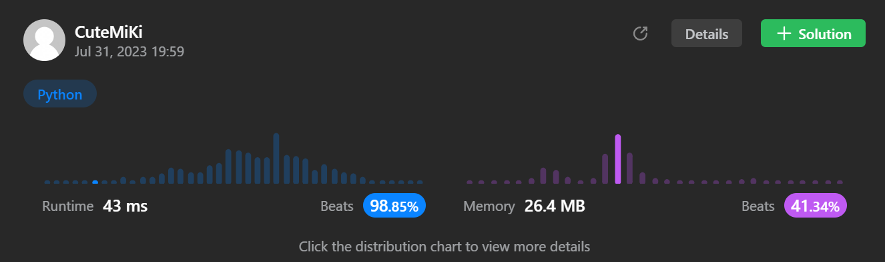

# 124. Binary Tree Maximum Path Sum
### Tag: [Hard](https://github.com/TheOnlyMiki/LeetCode-For-Fun/tree/main#hard-level), [Dynamic Programming](https://github.com/TheOnlyMiki/LeetCode-For-Fun/tree/main#dynamic-programming), [Depth-First Search](https://github.com/TheOnlyMiki/LeetCode-For-Fun/tree/main#depth-first-search), [Binary Tree](https://github.com/TheOnlyMiki/LeetCode-For-Fun/tree/main#binary-tree)
---
<div class="px-5 pt-4"><div class="flex"></div><div class="_1l1MA" data-track-load="description_content"><p>A <strong>path</strong> in a binary tree is a sequence of nodes where each pair of adjacent nodes in the sequence has an edge connecting them. A node can only appear in the sequence <strong>at most once</strong>. Note that the path does not need to pass through the root.</p>

<p>The <strong>path sum</strong> of a path is the sum of the node's values in the path.</p>

<p>Given the <code>root</code> of a binary tree, return <em>the maximum <strong>path sum</strong> of any <strong>non-empty</strong> path</em>.</p>

<p>&nbsp;</p>
<p><strong class="example">Example 1:</strong></p>

<pre><strong>Input:</strong> root = [1,2,3]
<strong>Output:</strong> 6
<strong>Explanation:</strong> The optimal path is 2 -&gt; 1 -&gt; 3 with a path sum of 2 + 1 + 3 = 6.
</pre>

<p><strong class="example">Example 2:</strong></p>

<pre><strong>Input:</strong> root = [-10,9,20,null,null,15,7]
<strong>Output:</strong> 42
<strong>Explanation:</strong> The optimal path is 15 -&gt; 20 -&gt; 7 with a path sum of 15 + 20 + 7 = 42.
</pre>

<p>&nbsp;</p>
<p><strong>Constraints:</strong></p>

<ul>
	<li>The number of nodes in the tree is in the range <code>[1, 3 * 10<sup>4</sup>]</code>.</li>
	<li><code>-1000 &lt;= Node.val &lt;= 1000</code></li>
</ul>
</div></div>

---


### Solution

```python
# Definition for a binary tree node.
# class TreeNode(object):
#     def __init__(self, val=0, left=None, right=None):
#         self.val = val
#         self.left = left
#         self.right = right
class Solution(object):
    def maxPathSum(self, root):
        """
        :type root: TreeNode
        :rtype: int
        """
        # Option 2
        self.max_sum = -1001

        def findMaxPathSum2(root):
            if not root:
                return 0

            left_max = max(findMaxPathSum2(root.left), 0)
            right_max = max(findMaxPathSum2(root.right), 0)

            self.max_sum = max(self.max_sum, root.val + left_max + right_max)

            return root.val + max(left_max, right_max)

        findMaxPathSum2(root)
        return self.max_sum
         
        # Option 1 - This is not corret, this is for maximum whole path
        """
        def findMaxPathSum(root):
            if root.left and root.right:
                left_max, pre_left_max_sum = findMaxPathSum(root.left)
                right_max, pre_right_max_sum = findMaxPathSum(root.right)

                connect_max_sum = max(left_max + root.val, right_max + root.val, root.val, left_max + right_max + root.val)
                suboptimal_max_sum = max(left_max, right_max, pre_left_max_sum, pre_right_max_sum, connect_max_sum)
                print("LR:", root.val, connect_max_sum, suboptimal_max_sum)
                return connect_max_sum, suboptimal_max_sum
            elif root.left:
                left_max, pre_max_sum = findMaxPathSum(root.left)
                connect_max_sum = max(left_max + root.val, root.val)
                suboptimal_max_sum = max(left_max, pre_max_sum, connect_max_sum)
                print("L:", root.val, connect_max_sum, suboptimal_max_sum)
                return connect_max_sum, suboptimal_max_sum
            elif root.right:
                right_max, pre_max_sum = findMaxPathSum(root.right)
                connect_max_sum = max(right_max + root.val, root.val)
                suboptimal_max_sum = max(right_max, pre_max_sum, connect_max_sum)
                print("R:", root.val, connect_max_sum, suboptimal_max_sum)
                return connect_max_sum, suboptimal_max_sum
            else:
                print("E:", root.val)
                return root.val, root.val

        return max(findMaxPathSum(root))
        """
```
