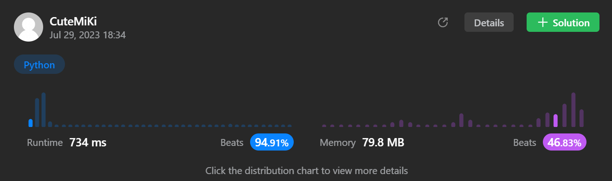

# 146. LRU Cache
### Tag: [Medium](https://github.com/TheOnlyMiki/LeetCode-For-Fun/tree/main#medium-level), [Hash Table](https://github.com/TheOnlyMiki/LeetCode-For-Fun/tree/main#hash-table), [Linked List](https://github.com/TheOnlyMiki/LeetCode-For-Fun/tree/main#linked-list), [Design](https://github.com/TheOnlyMiki/LeetCode-For-Fun/tree/main#design)
---
<div class="px-5 pt-4"><div class="flex"></div><div class="_1l1MA" data-track-load="description_content"><p>Design a data structure that follows the constraints of a <strong><a href="https://en.wikipedia.org/wiki/Cache_replacement_policies#LRU" target="_blank">Least Recently Used (LRU) cache</a></strong>.</p>

<p>Implement the <code>LRUCache</code> class:</p>

<ul>
	<li><code>LRUCache(int capacity)</code> Initialize the LRU cache with <strong>positive</strong> size <code>capacity</code>.</li>
	<li><code>int get(int key)</code> Return the value of the <code>key</code> if the key exists, otherwise return <code>-1</code>.</li>
	<li><code>void put(int key, int value)</code> Update the value of the <code>key</code> if the <code>key</code> exists. Otherwise, add the <code>key-value</code> pair to the cache. If the number of keys exceeds the <code>capacity</code> from this operation, <strong>evict</strong> the least recently used key.</li>
</ul>

<p>The functions <code>get</code> and <code>put</code> must each run in <code>O(1)</code> average time complexity.</p>

<p>&nbsp;</p>
<p><strong class="example">Example 1:</strong></p>

<pre><strong>Input</strong>
["LRUCache", "put", "put", "get", "put", "get", "put", "get", "get", "get"]
[[2], [1, 1], [2, 2], [1], [3, 3], [2], [4, 4], [1], [3], [4]]
<strong>Output</strong>
[null, null, null, 1, null, -1, null, -1, 3, 4]

<strong>Explanation</strong>
LRUCache lRUCache = new LRUCache(2);
lRUCache.put(1, 1); // cache is {1=1}
lRUCache.put(2, 2); // cache is {1=1, 2=2}
lRUCache.get(1);    // return 1
lRUCache.put(3, 3); // LRU key was 2, evicts key 2, cache is {1=1, 3=3}
lRUCache.get(2);    // returns -1 (not found)
lRUCache.put(4, 4); // LRU key was 1, evicts key 1, cache is {4=4, 3=3}
lRUCache.get(1);    // return -1 (not found)
lRUCache.get(3);    // return 3
lRUCache.get(4);    // return 4
</pre>

<p>&nbsp;</p>
<p><strong>Constraints:</strong></p>

<ul>
	<li><code>1 &lt;= capacity &lt;= 3000</code></li>
	<li><code>0 &lt;= key &lt;= 10<sup>4</sup></code></li>
	<li><code>0 &lt;= value &lt;= 10<sup>5</sup></code></li>
	<li>At most <code>2 * 10<sup>5</sup></code> calls will be made to <code>get</code> and <code>put</code>.</li>
</ul>
</div></div>

---


### Solution

```python
class ListNode(object):
    def __init__(self, key=0, val=0, next=None, previou=None):
        self.key = key
        self.val = val
        self.next = next
        self.previou = previou 

class LRUCache(object):

    def __init__(self, capacity):
        """
        :type capacity: int
        """
        self.max_length = capacity
        self.nodes = {}
        self.head = ListNode()
        self.tail = ListNode()
        self.head.next = self.tail
        self.tail.previou = self.head

    def get(self, key):
        """
        :type key: int
        :rtype: int
        """
        if key in self.nodes:
            temp = self.nodes[key].val
            address = self.nodes.pop(key)
            address.previou.next = address.next
            address.next.previou = address.previou
            del address

            self.nodes[key] = ListNode(key, temp, self.tail, self.tail.previou)
            self.tail.previou.next = self.nodes[key]
            self.tail.previou = self.nodes[key]
            return temp
        return -1

    def put(self, key, value):
        """
        :type key: int
        :type value: int
        :rtype: None
        """
        if key in self.nodes:
            address = self.nodes.pop(key)
            address.previou.next = address.next
            address.next.previou = address.previou
            del address
        else:
            if len(self.nodes) == self.max_length:
                address = self.nodes.pop(self.head.next.key)
                self.head.next = address.next
                address.next.previou = self.head
                del address

        self.nodes[key] = ListNode(key, value, self.tail, self.tail.previou)
        self.tail.previou.next = self.nodes[key]
        self.tail.previou = self.nodes[key]

# Your LRUCache object will be instantiated and called as such:
# obj = LRUCache(capacity)
# param_1 = obj.get(key)
# obj.put(key,value)
```
